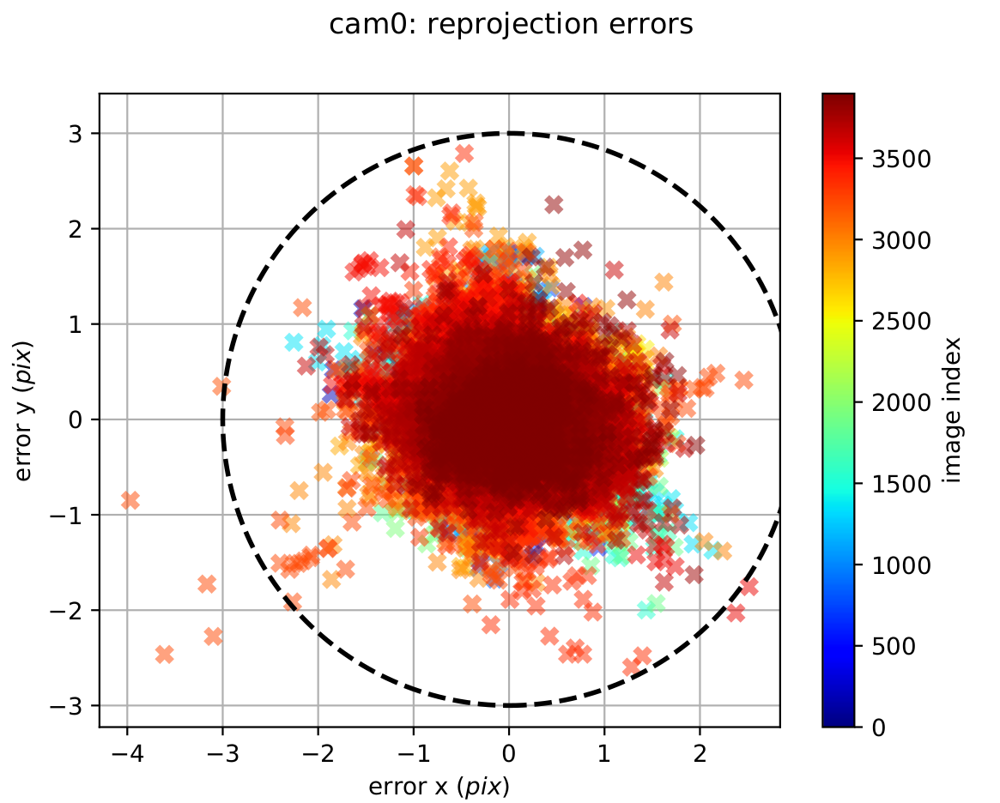

## Objective 
1. Understand what sensor calibration is and why it’s critical for localization and mapping.
2. Understand What is intrinisic and extrnisic callibration.
3. Perform intrinsic and extrinsic calibration using open-source tools.

The fundamental objective of sensor calibration in SLAM systems is to ensure accurate spatial perception by establishing precise mathematical relationships between sensor measurements and the physical world. As SLAM systems increasingly rely on multi-sensor fusion architectures, proper calibration becomes essential for maintaining spatial consistency across different sensing modalities. The goal is to minimize systematic errors that can propagate through the SLAM pipeline, ultimately affecting localization accuracy and map quality.

Current technological trends indicate a growing complexity in SLAM sensor configurations, with systems commonly integrating LiDAR, cameras, IMUs, wheel encoders, and other specialized sensors. Each sensor type introduces unique calibration challenges related to intrinsic parameters (internal characteristics) and extrinsic parameters (spatial relationships between sensors). The industry is moving toward more robust, automated calibration procedures that can adapt to environmental changes and sensor degradation over time.


### Common Reference Frames in Sensor Fusion and Calibration

In localization, mapping, and multi-sensor fusion, consistent definition and transformation between reference frames is essential. Each frame represents a coordinate system attached to a specific entity (e.g., world, robot, sensor). Below are the most common frames used in SLAM and calibration systems.

  1. **World Frame**: The World frame (or Map frame) is a global, fixed reference system used to express the absolute position and orientation of the robot and environment.The Zₚ axis typically points upward (or opposite to gravity, depending on convention).The origin is arbitrarily set at the system initialization, often at the robot’s or camera’s starting pose.

  2. **Odome Frame**: is a local reference frame used to track the robot’s motion over time relative to its starting position. It is typically updated incrementally by wheel encoders, visual odometry, or other motion estimation sensors.


  3. **Body Frame**: represents the robot’s physical body, typically attached to the IMU or the vehicle chassis.
  It acts as the central reference for all onboard sensors (LiDAR, cameras, GNSS, etc.).In a right-handed coordinate system, the x-axis points forward in the robot’s motion direction, the y-axis points to the left, and the z-axis points upward.


  4. **Camera Frame**: The Camera Frame (C) is centered at the optical center of the camera and follows computer vision conventions. The z-axis points forward along the optical axis, x-axis points right, and y-axis points downward, aligned with image coordinates. This differs from the body or IMU frame (where z points upward). In multi-camera systems, each camera (C1,C2) has its own pose relative to the body frame, defined by the extrinsic transform.This frame is fundamental for projecting 3D world points onto the image plane.
  

  5. **Image (Pixel) Frame**: The Image Frame (I) is a 2D coordinate system on the camera’s image plane, where each point corresponds to a pixel location. The origin (u=0,v=0) is typically at the top-left corner, with the u-axis pointing right and v-axis pointing down. 3D points from the camera frame are projected into this frame using the camera intrinsic matrix (K) and distortion model.


###  Camera Callibration 

 **Intrinsic Callibration** 

Intrinsic calibration estimates the camera’s internal parameters, describing how 3D points in the camera frame are projected onto the 2D image plane.we use camera intrinsic parameter matrix, describes some of the physical properties of the camera lens. It is a 3x3 matrix with the following form:

  <div style="margin-left: 65px;">
  
  </div>

  - fu and fv (fx and fy): These two parameters are the focal length of the camera, usually in pixels. fx for the x-direction and fy for the y-direction. Ideally, fx and fy should be equal, as most cameras have square pixels. However, in practical applications, they may differ due to reasons such as lens distortion and manufacturing errors.

  - cu and cv (cx and cy): These two parameters are the coordinates of the image center (principal point). Ideally, the principal point should be at the exact center of the image. However, in practice, it may deviate due to various reasons (e.g., lens shift, manufacturing error, etc.).

  Convert a point Pc=(Xc, Yc, Zc) in the camera coordinate system to a point Pi=(u,v) in the image/pixel coordinate system. The transformation process can be expressed as:
    
  <div style="margin-left: 65px;">
    
  </div>


  **Distortion Coefficients**: Real lenses usually deviate from the ideal pinhole camera model, introducing significant distortion to images. As a result, camera parameters include Distortion Coefficients in addition to intrinsics and extrinsics. The main types of distortion are radial distortion and tangential distortion.


  
**Callibration Target**- Camera calibration relies on predictably shaped and easy to localize calibration targets. Knowing the targets to identify in calibration images along with their spacing allows the optimization to reason about how the targets exist in space.Popular targets include checkerboard patterns, Aruco markers, Charuco markers, and circle grids, with potential modifications on those few.

Checkerboard patterns are simple and easy to use.OpenCV has a chessboard calibration library that attempts to map points in 3D on a real-world chessboard to 2D camera coordinates.Any object could have been used (a book, a laptop computer, a car, etc.), but a chessboard has unique characteristics that make it well-suited for the job of correcting camera distortions:

- It is flat, so you don’t need to deal with the z-axis (z=0), only the x and y-axis. All the points on the chessboard lie on the same plane.

- There are clear corners and points, making it easy to map points in the 3D real world coordinate system to points on the camera’s 2D pixel coordinate system.
- The points and corners all occur on straight lines and with the same space.

This tutorial uses a 8x6 checkerboard with 0.23cm squares. Calibration uses the interior vertex points of the checkerboard, so an “9x7” board uses the interior vertex parameter “8x6” as in the example below. 

There are a number of camera calibration tools available to do this calibration, but if you’re already working in ROS, one of the easier options is the `camera_calibration` package.

1. To start first install docker and setup environment.This docker environment installs `camera_callibration` package with in `ros2-humble`.
      ```
        git --recurse-submodules clone git@github.com:eliyaskidnae/slam-tutorial-practical.git #Clone the repository with all submodules (only if you haven't cloned it yet)
        cd slam-tutorial-practical/camera_callibration_ws/
        docker compose up --build -d 
        docker compose exec callibration bash --login
        source /opt/ros/humble/setup.bash
        colcon build 
      ```

2. The next thing we need is data for the calibration to be run on. Normally, you would be able to use a live camera feed for the intrinsic calibration, but to make this training more universally accessible and repeatable, we will be working from bag files.
Download `rosbag2_callibration1` file and put it `camera_callibration_ws/resources` folder.

      In the first one, run the first rosbag file on loop inside docker environment.  
      ```
      docker compose exec callibration bash --login
      cd ~/callibration_ws/resources
      ros2 bag play rosbag2_callibration1 
      ```
      In the second terminal, run the camera calibration node

      ```
      docker compose exec callibration bash --login
      source install/setup.bash
      ros2 run camera_calibration cameracalibrator  --size 8x6 --square 0.023 --ros-args --remap image:=/zed/zed_node/left/color/raw/image  --remap camera:=zed/zed_node/left/color/raw
      ```
    We use the above command to calibrate the ZED camera’s left lens using the raw image topic `/zed/zed_node/left/color/raw/image`. The `--size 8x6` option specifies that the checkerboard used has 8 inner corners horizontally and 6 vertically, and `--square 0.023` sets the square size to 0.023 meters. The `--remap` arguments link the calibration node to the correct image and camera topics `namespace` recorded in the bag file.
    
3. You should see a pop-up.In order to get a good calibration you will need to move the checkerboard around in the camera frame such that:checkerboard on the camera’s left, right, top and bottom of field of view
   - X bar - left/right in field of view
   - Y bar - top/bottom in field of view
   - Size bar - toward/away and tilt from the camera
   - checkerboard filling the whole field of view
   - checkerboard tilted to the left, right, top and bottom (Skew)


<table>
  <tr>
    <td>
      <figure>
        
        <figcaption><strong>Figure 1</strong>- Size bar-toward/away from the camera </figcaption>
      </figure>
    </td>
    <td>
      <figure>
        
        <figcaption><strong>Figure 2</strong>- X bar - left/right in field of view</figcaption>
      </figure>
    </td>
    
  </tr>
  <tr>
    <td>
      <figure>
        
        <figcaption><strong>Figure 3</strong>- Y bar - top/bottom in field of view</figcaption>
      </figure>
    </td>
    <td>
      <figure>
        
        <figcaption><strong>Figure 4</strong>- Skew bar - checkerboard tilted.</figcaption>
      </figure>
    </td>

  </tr>
</table>

4. When all the 4 bars are green and enough data is available for calibration the **CALIBRATE** button will light up. Click it to see the results. It takes around the minute for calibration to take place.After the calibration is completed the **SAVE** and **commit** buttons light up. And you can also see the result in terminal.

    A successful calibration typically has a mean reprojection error below 0.3 px.The closer to zero, the better.In our case, the GUI shows a 0.23 px error (displayed as “lin” in Figure 5), indicating accurate calibration.


5. To record these parameters down, click save.It will save to `/tmp/calibrationdata.tar`.gz.Let’s get the files somewhere we can easily reach them

    ```
      mkdir ~/calibration_ws/mono_camera
      mv /tmp/calibrationdata.tar.gz ~/calibration_ws/mono_camera
      cd ~/calibration_ws/src/mono_camera
      tar -xvf calibrationdata.tar.gz
    ```

This records all the original images used for the calibration, as well as the calibration parameters in two files: `ost.txt` and `ost.yaml`. Different applications expect intrinsics in a number of different ways, so you’ll likely have to place particular parameters from these files in a certain structure.

The camera calibration YAML file stores the camera’s intrinsic parameters for image correction.  
The main parts are:

- **Image size** – width and height of the calibration images.  
- **Camera matrix (K)** – defines intrinsic parameters such as focal lengths and optical center.  
- **Distortion coefficients** – describe lens distortion for image undistortion.  
- **Rectification matrix (R)** – aligns images to a common plane; identity for mono cameras.  
- **Projection matrix (P)** – maps 3D camera coordinates to 2D image pixels and may differ from K after rectification.


The calibration results should be applied to the raw image so subsequent image processing can use corrected images. In ROS2, this is done in two steps:

1. Copy the calibration YAML file to `camera_pipeline` package.This uses the callibration file to rectify the raw image as `image_rect` topic.  

    ```
    cp ~/calibration_ws/camera0_cal/calibrationdata/ost.yaml \
      ~/calibration_ws/src/camera_pipeline/config/

    ros2 launch camera_pipeline camera_info.launch.py image_raw:=/zed/zed_node/left/color/raw/image

    ```

2. Open a new terminal and launch RViz with two image displays:
`/zed/zed_node/left/color/raw/image` and `/image_rect.`

Play the rosbag and pause it with the spacebar.
As illustrated in the images below, the left (raw) image appears distorted, with the vertical bar inside the red highlighted region noticeably curved. In contrast, the right (rectified) image shows the same bar as a straight line, demonstrating that the camera calibration and rectification process effectively corrected the lens distortion.


<table style="border-collapse: collapse; width: 100%; border: none;">
  <tr>
    <td style="padding: 0; text-align: center; vertical-align: top;">
      <figure style="margin: 0;">
        
        <figcaption style="font-size: 14px; margin-top: 4px;">
          <strong>Figure 5</strong> – raw image
        </figcaption>
      </figure>
    </td>
    <td style="padding: 0; text-align: center; vertical-align: top;">
      <figure style="margin: 0;">
        
        <figcaption style="font-size: 14px; margin-top: 4px;">
          <strong>Figure 6</strong> – corrected(rectifed) image
        </figcaption>
      </figure>
    </td>
  </tr>
</table>


**Extrinisic Callibration**

  Extrinsic calibration determines the camera’s pose relative to another reference frame, such as the world, body, or another sensor (e.g., camera or LiDAR). It defines how different sensors are spatially related and enables consistent projection of points between coordinate systems. In multi-camera or sensor-fusion setups, accurate extrinsic calibration ensures proper alignment between the camera, IMU, and LiDAR, which is essential for reliable stereo vision, visual-inertial odometry, and SLAM applications.

  For this experiment, we use the ZED stereo camera to perform extrinsic calibration.
  The goal is to estimate the relative pose of the right camera with respect to the left camera, which defines the stereo baseline — the physical separation and orientation difference between the two lenses.

  The resulting extrinsic parameters (rotation R and translation T) describe how to transform points from the right camera’s coordinate frame into the left camera’s coordinate frame. These parameters are later used for stereo rectification and depth estimation.

  1. First download the two provided ROS 2 bag files:

  - **`stereo_large_board_bagfile.bag`** – recorded using a small checkerboard *(2.3 cm squares)*  
  - **`stereo_small_board_bagfile.bag`** – recorded using a large checkerboard *(11.8 cm squares)*  

    Place both bag files in the `camera_callibration_ws/resources/` directory of the calibration workspace:

  2. Run the bag file and camera_calibration tool from the image_pipeline package to perform stereo calibration:

      In the first one, run the first rosbag file on loop.  
      ```
      docker compose exec callibration bash --login
      cd resources/
      ros2 bag play rosbag2_stereo_large_board
      ```

      In the second terminal, run the camera calibration node
      ```
      docker compose exec callibration bash --login
      ros2 run camera_calibration cameracalibrator --approximate 0.1 --size 8x6 --square 0.118 --ros-args --remap left:=/zed/zed_node/left/color/raw/image --remap right:=/zed/zed_node/right/color/raw/image    --remap left_camera:=zed/zed_node/left/color/raw --remap right_camera:=zed/zed_node/right/color/raw
      ```
  3. You should see a pop-up.In order to get a good calibration you will need to move the checkerboard around in the camera frame.When all the 4 bars are green and enough data is available for calibration the **CALIBRATE** button will light up. Click it to see the results. It takes around the minute for calibration to take place.After the calibration is completed the **SAVE** and **COMMIT** buttons light up. And you can also see the result in terminal.

  4. To record these parameters down, click save.It will save to `/tmp/calibrationdata.tar`.gz.Let’s get the files somewhere we can easily reach them

      ```
        mkdir ~/callibration_ws/resources/stereo_camera_large_board_cali/
        mv /tmp/calibrationdata.tar.gz ~/callibration_ws/resources/stereo_camera_large_board_cali/
        cd ~/calibration_ws/src/stereo_camera_large_board_cali
        tar -xvf calibrationdata.tar.gz
      ```
      Inside the extracted folder, you will find:`left.yaml`(parameters of the left camera) and `right.yaml`(parameters of the right camera) The structure of these files is similar to those obtained from intrinsic calibration. However, to analyze the extrinsic calibration, we focus on the **projection matrices** (P matrices).

      Left Camera Projection Matricx 
                                       
       ```    
         data: [ 279.01721 ,   0.      ,  318.71177,   0.   ,       
                    0.     , 279.01721 ,  179.75161,   0.   ,     
                    0.     ,   0.      ,   1.      ,   0.    ]     
       ```

      Right Camera Projection Matrix 

      ```
        data: [ 279.01721,   0.       ,  318.71177, -33.6074 ,
                  0.     ,  279.01721 ,  179.75161,   0.     ,
                  0.     ,   0.       ,   1.      ,   0.     ]
      ```

      The fourth element in the first row of the **right projection matrix** (here `-33.6074`) represents the **translation of the right camera along the x-axis** relative to the left camera.  
      This value corresponds to the **baseline distance** between the two camera centers when scaled by the focal length:

      Mathematically:
      $$
        \text{Baseline} = -\frac{P_{14}}{f_x}  
      $$

      Using the given data:
      $$
      \text{Baseline} = -\frac{-33.6074}{279.01721} \approx 0.1204 \, \text{m}
      $$

      Thus, the two cameras are separated by approximately **12.04 cm**, which matches the expected ZED stereo baseline.


      For parallel stereo cameras, the left and right cameras are almost perfectly aligned.This means the **rotation matrix** \(R\) between them is **close to the identity matrix**:which simplifies stereo processing.If the cameras were not parallel, a QR decomposition or SVD on a normalized version of the projection matrix can be used to to separate the rotation component

      Now consider the `stereo_small_board_bagfile.bag` with a small checkerboard (`--square 0.023` m):

      ```
      data: [284.05017 ,   0.       , 294.69019 , -34.89335,
                0.     ,  284.05017 , 181.08418 ,   0.     ,
                0.     ,   0.       ,   1.      ,   0.     ]
      ```

      $$
      \text{Baseline} = -\frac{-34.89335}{284.05017} \approx 0.123 \, \text{m}
      $$

      Using a large checkerboard, the reprojection error is very low, less than 0.2 pixels, whereas using a small checkerboard results in a much higher error, greater than 1.2 pixels. The manufacturer-specified baseline for the ZED stereo camera is 12 cm, which is closely matched by the baseline obtained with the large checkerboard. In contrast, the high epipolar reprojection error observed with the small checkerboard indicates that this calibration is poor, and the resulting baseline does not align with the expected manufacturer value.

      <table style="border-collapse: collapse; width: 100%; border: none;">
        <tr>
          <td style="padding: 0; text-align: center; vertical-align: top;">
            <figure style="margin: 0;">
              
              <figcaption style="font-size: 14px; margin-top: 4px;">
                <strong>Epipolar reprojection error with large checkerboard</strong> 
              </figcaption>
            </figure>
          </td>
          <td style="padding: 0; text-align: center; vertical-align: top;">
             <figure style="margin: 0;">
              
              <figcaption style="font-size: 14px; margin-top: 4px;">
                <strong>Epipolar reprojection error with small checkerboard</strong> 
              </figcaption>
            </figure>
          </td>
        </tr>
      </table>


### Camera-IMU Callibration

The goal of camera-IMU extrinsic calibration is to accurately determine the transformation that defines the spatial relationship between the camera and the IMU.In this tutorial, we use Kalibr, a widely used tool for camera–IMU calibration.

The following are prerequest to use `kaibr` callibration tool:

A. **Prepare the calibration target:** Kalibr supports multiple target types, but an AprilGrid is strongly recommended. It allows partial visibility of the board while still resolving the pose correctly, making data collection easier.
Before starting, print an AprilGrid from the [Kalibr wiki](https://github.com/ethz-asl/kalibr/wiki/calibration-targets) and fill out the corresponding aprilgrid.yaml(check [kaliber yaml formats](https://github.com/ethz-asl/kalibr/wiki/yaml-formats)) file:
   - Count the number of rows and columns, then fill in the values for tagsRows and tagsCols accordingly.
   - Measure the size of one AprilTag and set it as tagSize (in meters).
   - Measure the spacing (black border gap) between two tags.
   - Compute tagSpacing = spacing / tagSize.
For our tutoriall we will use a grid with 44 mm tags and 12.5 mm spacing.
  ```
    target_type: 'aprilgrid'  #gridtype
    tagCols: 6                 #number of apriltags
    tagRows: 6                 #number of apriltags
    tagSize: 0.0445            #size of apriltag, edge to edge [m]
    tagSpacing: 0.296          #ratio of space between tags to tagSize
    codeOffset: 0            #code offset for the first tag in the aprilboard
  ```
B. **Record the calibration dataset (rosbag)**: Record a rosbag containing IMU and camera data:
To achieve accurate calibration, perform the following motions while keeping the target always in view:

   - Pitch, yaw, and roll rotations
   - Up/down, left/right, forward/backward translations
   - A short sequence of smooth random motion

   Reference motion example: [See this YouTube video as an example:](https://youtu.be/puNXsnrYWTY?t=57)


C. **IMU noise parameters**: Kalibr requires IMU noise parameters such as noise density and random walk. These can come from the manufacturer’s datasheet or tools, but it is recommended to compute them using an Allan variance calibration, since IMU noise characteristics can change depending on the physical setup, mounting, and environment. A convenient ROS-based Allan variance tool is available here [allan_variance_ros](https://github.com/ori-drs/allan_variance_ros)
       
  For our tutoriall we will use a manufacturing callibration imu parametrs.
  ```
    #Accelerometers
    accelerometer_noise_density: 1.4e-03   #Noise density (continuous-time)
    accelerometer_random_walk:   8.0e-05   #Bias random walk
    #Gyroscopes
    gyroscope_noise_density:    8.712683324559951815e-5   #Noise density (continuous-time)
    gyroscope_random_walk:      0.00074001958110154640244   #Bias random walk
    rostopic:                    /zed/zed_node/imu/data_raw      #the IMU ROS topic
    update_rate:                 100.0     #Hz (for discretization of the values above)
  ```

Save this file as` imu-params.yaml`, which we will use as the input for the IMU calibration. After saving it, we can follow the steps below to run the calibration inside our Docker container.
1. To start first clone the docker container along with all its submodules (kaliber packages).This will build the Docker container with ROS 2 and all necessary dependencies for `Kaliber` package.
      ```
        
        git --recurse-submodules clone git@github.com:eliyaskidnae/slam-tutorial-practical.git # Clone the repository with all submodules (only if you haven't cloned it yet)
        cd slam-tutorial-practical/camera_imu_cal_ws/
        docker compose up --build -d 
        
      ```

2. Then opens a shell inside the Docker container, builds the Kalibr workspace and  sources the setup file.
      ```     
        cd slam-tutorial-practical/camera_imu_cal_ws/
        docker compose exec callibration bash --login
        catkin build -DCMAKE_BUILD_TYPE=Release -j4
        source devel/setup.bash
      ```
      check all packages are installed with out error.

3. The next thing we need is data for the calibration to be run on. Normally, you would be able to use a live camera feed for the intrinsic calibration, but to make this training more universally accessible and repeatable, we will be working from bag files.
Download `kaliber_ros1.bag` file and put it `camera_imu_cal_ws/resources` folder.Put also the configuration files `april-grid.yaml` and `imu_param.yaml` inside `/camera_imu_cal_ws/resources`.

      check for the bag file if it contains left and right camera topics as well as imu-raw topic.
      ```
      cd resources/
      rosbag info kaliber_ros1.bag 
      ```

4. The kaliber imu-camera calibration requires the intrinisic and extinisic callibration of both cameras.We can use other camera callibration and put it the [Kalibr YAML format documentation](https://github.com/ethz-asl/kalibr/wiki/yaml-formats) or perform a new calibration using Kalibr’s camera calibration tool as foolowing command:

      run the kalibr camera calibration node
      ```
      rosrun kalibr kalibr_calibrate_cameras --bag resources/kalib_ros1.bag --topics /zed/zed_node/left/color/rect/image /zed/zed_node/right/color/rect/image --models pinhole-radtan pinhole-radtan --target resources/april-grid.yaml --show-extraction 
      ```
    When the calibration is complete (it takes many minutes according to the number of image acquired) you will get the file `kalib_ros1-camchain.yaml` and a full PDF report of the result of the calibration inside ~/callibration_ros1_ws/resources folder.

    The quality of the camera calibration can be verified by inspecting the reprojection error scatter plots. In these plots, each point represents the difference between the detected AprilGrid corner and its projected location based on the estimated camera model.Since the points are tightly clustered around zero and the error stays below about 0.5 pixels with a Gaussian-like distribution, this indicates a good and reliable calibration.

    <table style="border-collapse: collapse; width: 100%; border: none;">
        <tr>
          <td style="padding: 0; vertical-align: top;">
            <figure style="margin: 0;">
              
              <figcaption style="font-size: 12px; margin-top: 4px; padding-left: 50px">
                <strong>Camera reprojection error</strong> 
              </figcaption>
            </figure>
          </td>
        </tr>
    </table>

 5. Put the imu noise parametr as `imu-params.yaml`  in  `camera_imu_cal_ws/resources`.
    
      Then run the camera-imu callibration node.

```bash
rosrun kalibr  kalibr_calibrate_imu_camera --bag resources/kaliber_ros1.bag --cam resources/kalib_ros1-camchain.yaml --imu resources/imu-params.yaml --target resources/april-grid.yaml
```

      After running kalibr_calibrate_imu_camera node, the camera calibration yaml will be extended by the imu-camera calibrator with imu-camera transformations.We can get also  a PDF report containing the final calibration result and calibration analyses.

      ```yaml
      cam0:
        T_cam_imu:
        - [-0.0012069682380942137, -0.999959553566699, 0.00891260109951475, 0.02374101772612174]
        - [0.0012353350482965375, -0.008914091742802915, -0.9999595056379624, 0.0019871949034301313]
        - [0.9999985085863826, -0.001195909314175625, 0.0012460441090049457, -0.004969454993572966]
        - [0.0, 0.0, 0.0, 1.0]
        timeshift_cam_imu: 0.008473177395364007
      cam1:
        T_cam_imu:
        - [0.007688606532579134, -0.9999287036348504, 0.00913635467321633, -0.09582559937006864]
        - [0.0012368931016336626, -0.009127107873462909, -0.9999575820990215, 0.0020721431219515286]
        - [0.9999696772527866, 0.007699581092098007, 0.001166630174431943, -0.004792821181560303]
        - [0.0, 0.0, 0.0, 1.0]
        T_cn_cnm1:
        - [0.999960408866058, -0.00021303049677720928, 0.00889580341679349, -0.1195210465345488]
        - [0.00021302277813165302, 0.9999999773089986, 1.8151958025746858e-06, 7.989990659499038e-05]
        - [-0.008895803601630881, 7.98848206438656e-08, 0.9999604315563049, 0.0003876324506602702]
        - [0.0, 0.0, 0.0, 1.0]
        timeshift_cam_imu: 0.008706209697421906
      ```
      
      Lets get the 3x3 rounded roation matrix from transformation matrix.

      ```yaml
      cam0_imu:[[0, -1,  0 ]
                [0,  0, -1 ]
                [1   0,  0 ]]   
                
      cam1_imu:[[0, -1,  0 ]
                [0,  0, -1 ]
                [1   0,  0 ]]

      ```
      
      The rotation matrix tells us how the IMU is oriented relative to the camera. From this result, we can see that the IMU’s X-axis is pointing in the same direction as the camera’s forward Z-axis, meaning both sensors face the same way. The IMU’s Y and Z axes are rotated so they line up with the camera’s horizontal and vertical directions. In simple terms, the IMU is mounted in a way that its forward axis matches the camera’s viewing direction, while the other axes are rotated to properly align the two coordinate frames
      
      Checking the translation part of the transformation matrix.
      ```
       cam0_imu:[0.02374, 0, 0]   cam1_imu:[-0.0958, 0, 0 ] cam0_cam1:[-0.11952, 0, 0]
      ```
      The translation part of the transformation matrix describes how far the IMU is located from each camera. For cam0, the IMU is shifted by +0.02374 m along the X-axis, meaning the IMU sits about 2.3 cm to the right of the left camera. For cam1, the translation is −0.0958 m, meaning the IMU is about 9.6 cm to the left of the right camera. When we combine these two offsets, we get the total distance between the two cameras. This value is estimated as −0.11952 m, meaning the right camera is approximately 11.95 cm to the right of the left camera, which is the stereo baseline of zed-camera(12 cm)
      
      The quality of the IMU–camera calibration can be assessed by examining the reprojection error scatter plots. A good calibration is indicated when the reprojection errors lie within the 3-sigma bounds and are tightly clustered around zero. Although some outliers may appear, fewer outliers and a stronger concentration near zero generally reflect a more accurate calibration. In our results, the majority of the points remain close to zero, showing that the calibration quality is acceptable and consistent.For more explanation 

      <table style="border-collapse: collapse; width: 100%; border: none;">
          <tr>
            <td style="padding: 0; vertical-align: top;">
              <figure style="margin: 0;">
                
                <figcaption style="font-size: 12px; margin-top: 4px; padding-left: 50px">
                  <strong> reprojection error</strong> 
                </figcaption>
              </figure>
            </td>
          </tr>
      </table>


      For more explanation about imu-camera calibration using kalibr package please refer this [video tutoriall](https://www.youtube.com/watch?v=BtzmsuJemgI)