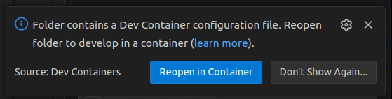
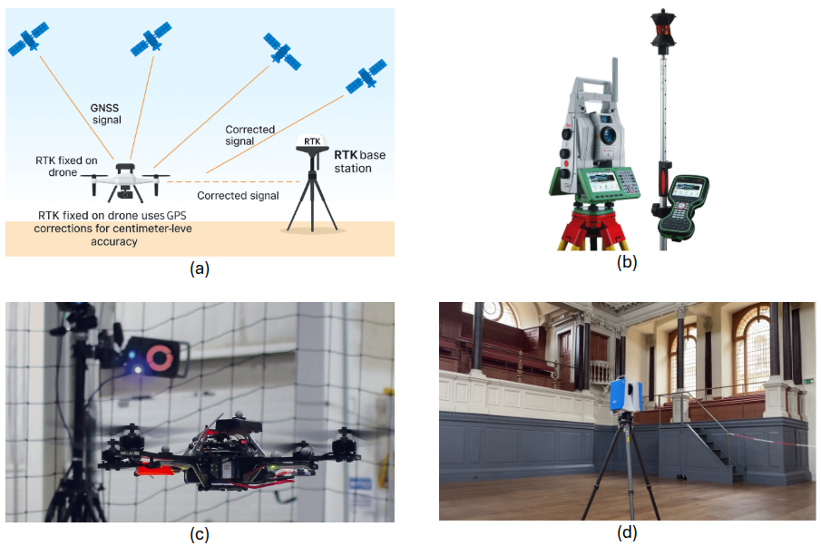

# Chapter 4: Deployment of SLAM

## 4.1 Objectives
In this chapter, we will be running SLAM algorithms on some pre-recorded data. At the end, you should get some insights on:

- How does the real-time sensor data inputted to SLAM look like
- How run an open-source SLAM
- What are common parameters to tune when running SLAM
- How to interpret SLAM results
- How to mitigate SLAM failures 


## 4.2 Deploying a camera-IMU SLAM

In previous chapters, we discussed camera sensors suitable for SLAM. We also explored different modality and configuration of cameras. When it comes to visual SLAM, one of the most repeatedly used sensor configurations is combination of a stereo-camera and IMU sensor. Of course, there many other possible additions to this setup, such as adding wheel odometry, GPS, LiDAR, or more number of cameras. However, the most repeatedly supported sensor configuration is still stereo+IMU setup. That is why there are many commercially ready to use setup follow this configuration. 

Why is this sensor setup ideal? First, stereo camera pair are able to understand the scene depth up to a certain distance. Increasing the range of depth estimation depends on how far the two cameras are from each other (baseline). Adding the IMU sensor, will make the position estimation in the SLAM more smoth and more reliable. Researches in SLAM prove better accuracy of IMU-aided visual SLAM compared to camera only.

Let us assume that we have acquired a stere+IMU sensor setup ideal for our application based on the instructions of chapter 2. Also, let us assume that we have calibrated our sensors according to the instructions in chapter 3. Now, we want to use this information to run a SLAM on our robot. If you dont have a robot already, no worries. We have prepared some data recorded on our real robots within SMARTNav dataset. The data is recorded in ROS2 bag format, meaning that by playing back the bag file, it is as if you are getting real-time stream of sensor data just like in a real robot.

### 4.2.1 VINS-Fusion algorithm

**VINS-Fusion** is widely used in research and sometomes adopted in industry because it is relatively mature, open-source, and has good performance in many real-world scenarios.
It is designed to work with several sensor setups, but the most common configuration (and the one we use in this chapter) is a stereo camera + IMU. By fusing these two sources of information, VINS-Fusion can produce smoother and more robust trajectories than a camera-only SLAM system, especially during fast motions, rotations, or in low-texture regions.

At a high level, VINS-Fusion has three main components:

- **Visual front-end**:
The visual front-end detects and tracks feature points in the images (for example, corners or small textured patches). These tracked features are used to reconstruct the relative motion of the camera between frames and to triangulate 3D landmarks in the environment. In the stereo case, depth can be obtained directly from the left–right image pair, which improves the stability of the system and helps with scale estimation.

- **Inertial (IMU) integration and optimization back-end**:
The IMU measurements are continuously integrated (often called IMU preintegration) to predict how the pose should evolve between image frames. This prediction is then combined with the visual measurements in a nonlinear optimization problem. The back-end maintains a sliding window of recent keyframes and IMU measurements and solves for the poses, velocities, IMU biases, and landmark positions that best explain all the data. This optimization-based approach allows VINS-Fusion to correct drift, handle sensor noise, and provide a consistent state estimate.

- **Loop closure and map optimization (Fusion part)**:
Over time, any odometry system will accumulate drift. VINS-Fusion includes a loop closure module that tries to recognize when the robot revisits a previously seen area. It uses image-based place recognition and geometric verification to detect these loop closures. When a loop is confirmed, a pose graph optimization step adjusts the whole trajectory to reduce accumulated error. This “global” correction can significantly improve the overall accuracy of the path and map.

From a user perspective, you can think of VINS-Fusion as a pipeline with tunable parameters rather than a black box. You can configure camera intrinsics, stereo baseline, IMU noise parameters, feature detection thresholds, and loop closure options. In this chapter, we will not go deep into the underlying mathematics, but we will see how these parameters affect the behavior of the system when we run it on real data. The goal is that by the end, you will know how to launch VINS-Fusion on a dataset (or real-time stream of data from your robot's sensors), how to recognize when it works well or fails, and which basic parameters you can adjust to improve robustness for your own application.

### 4.2.2 Running a demo
To run the VINS-Fusion algorithm, we have tried to simplify the proecess of prerequisite installation, compilation, and fixing compatibility issues, often encountered when working with open-source software. To resolve this, please make sure you have docker and Visual Studio Code installed on your system.
https://code.visualstudio.com/docs/devcontainers/containers

Next, you should clone the github repository that we prepared for this course. You can use the following command in a terminal (if you already have it cloned in the previous chapter, you can skip this step):
```bash
git clone --recursive https://github.com/SaxionMechatronics/slam-tutorial-practical.git
git submodule update --init --recursive
```

Next, navigate to the `slam-tutorial-practical/slam_deployment` folder and open the VS Code. Inside the VS Code you can usually see a pop-up at the bottom-right corner, suggesting that the folder is a docker container and that you can set up the container. Choose the **Reopen in Container** option.

<div style="display:flex; flex-wrap:wrap; gap:8px; justify-content:center; align-items:flex-start">
  
  <div style="font-size:0.85em; flex-basis:100%; text-align:center; margin-top:6px;">
  </div>
</div>

 Another option is to use the **Ctrl+Shift+P** kreyboard buttons, and look for and option for building and opening a container. The building and opening of the container might take a few minutes, depending on your processors, due to the compilation of all the prerequisites and the SLAM source code itself. 
If all goes well, you will be notified by this message at the VS Code's terminal: **Done. Press any key to close the terminal.** 

 <div style="display:flex; flex-wrap:wrap; gap:8px; justify-content:center; align-items:flex-start">
  
  <div style="font-size:0.85em; flex-basis:100%; text-align:center; margin-top:6px;">
  </div>
</div>

Here you can open a fresh terminal from the VS Code menue: **Terminal -> New Terminal**

<div style="display:flex; flex-wrap:wrap; gap:8px; justify-content:center; align-items:flex-start">
  
  <div style="font-size:0.85em; flex-basis:100%; text-align:center; margin-top:6px;">
  </div>
</div>

Now, make sure you have one the prerecorded data sequence that we have made available on our [web-page](https://saxionmechatronics.github.io/smartnav-dataset/). Download one of the sequences that their name starts with `optitrack`. In this example, we use `optitrack_handheld_3`. These sequences of data are recorded using a stereo camera plus and IMU sensor mounted on a drone that is either flying or being carried by hand at a small room:

<div style="display:flex; flex-wrap:wrap; gap:8px; justify-content:center; align-items:flex-start">
  
  <div style="font-size:0.85em; flex-basis:100%; text-align:center; margin-top:6px;">
  </div>
</div>

After you download the zipped file of the sequence, extract it in the `slam-tutorial-practical/slam_deployment` directory. We extracted it under a folder named `data`.
In the newly opened terminal, use the following launch command to start the SLAM running on the prerecorded sequence:
```bash
ros2 launch vins vins_rviz.launch.py config:=VINS-Fusion-ROS2/config/zed2_gray/main_conf.yaml bag_folder:=data/optitrack_handheld_3/
```

In the above command, there are two parameters that you can change. First one is the `config` argument, which is the path to a file that all the configurations needed by VINS-Fusion are stored. These configurations contain descriptions of the you sensors and the calibration info needed by the SLAM algorithm to run properly. Additionally, some other algorithm-related parameters are specified in these files. If you want to run this SLAM for your custom setup, you need to prepare a custom config file, which we will talk more about it in the next sections.

The other parameter passed in the above command (`bag_folder`) is the path to a ROS2 bag file, which already downloaded and placed in the workspace. If you wanted to use another sequence you can change this parameter. Note that the sensors used to record this data should be the same sensors that are described in the config file.

At the end, you should be able to see the `RViz` visualization tool opened similar to the following video:

<video width="800" controls>
  <source src="images/VIO_small.webm" type="video/webm">
  Your browser does not support the video tag.
</video>

Let's briefly discuss what you see in this video. At the bottom of the video, the images from the left and right cameras are displayed. On the images, you can see that some feature points are drawn in form of red and green points. The algorithm here, is tracking the spots in the envrionment that easy to identify and track. The red features, are the features that the algorithm has tracked over time. These are points that are tracked between consecutive frames of left camera. Tracking them is essential for estimating the camera motion over time. The green ones, are the features that are matching between the left and right frames, and they help estimating the distance of these points from the camera.

After the features are successfully tracked, the algorithm tries estimating the 3D position of these features in the environment, and keeps refining their position. Their 3D positions are drawn with white points cubes in the 3D interactive viewport.

The camera's position and orientation is visible by the 3 axes in the viewport. The red axis is the x direction of the camera (front), the green one is the y axis (left), and the blue axis is the the z (up) direction. As the robot is carried in the environment, the history of its positions (its path) is drawn as a curve green. 

What you saw in this demo, is basically known as the Visual-Inertial Odometry. Our algorithm is fusing the camera image information (through the features it is tracking) with the IMU sensor's data and is estimation the motion of the camera in the environment. If at some point of the estimation, something goes wrong (featureless environment or very noisy IMU), and we get few inaccurate motion estimations, that inaccuracy will bias our estimation position of the camera forever. In other words, the position estimation will deviate from reality, and the odometry method does not have a solution for that. To fix this, we will later discuss the loop closure mechanism that rectifies such drifts.

### 4.2.3 Preparing a custom config file using calibration output
Each open-source SLAM usually uses a slightly different format. Since we introduced the Kalibr package for calibrating the camera-imu, we should be careful about how we should use the value outputted by the calibrator. Since we chose VINS-Fusion as a visual SLAM method in this chapter due to its common use and relative robustness, we should convert Kalibr outputs into VINS-Fusion format. This step is slightly different in different open-source SLAM algorithms. Sometime the algorithms can directly read the Kalibr output and sometime some re-formatting is needed. Generally it is a good idea for our knowledge if we transfer these values manually (as done in this chapter) so that we can also get a sense of how the calibration results go into a SLAM.

 Here we want to use a sample data recorded using a camera-imu installed on a drone that is flying in indoor environment. You can find the recorded file (ROS2 bag) in SMARTNav dataset, named `optitrack_hanfheld_3`. This configuration has a stereo camera (`cam0` and `cam1`) and an IMU. For the specific case of VINS-Fusion algorithm, for every robot setup we need 3 configuration files required.
 These 3 files are:
 - `cam0` intrinsic calibration info
 - `cam1` intrinsic calibration info
 - camera-imu and camera-camera extrinsic calibration info along with the algorithm's parameters

 For preparing these files, the easiest way to to use a previously created config file, and only change the entries according to your sensor setup calibration. In the dev container that we shared with you, there is a config folder for our camera called `zed2_gray`. You can create a similar folder there and rename it to your custom setup and start modifying the files inside it as we describe below.

 Let's start with preparing the camera intrinsic file. We will name this file `left.yaml`. This file has the following format:

```yaml
%YAML:1.0
---
model_type: PINHOLE
camera_name: camera
image_width: ...
image_height: ...
distortion_parameters:
   k1: ...
   k2: ...
   p1: ...
   p2: ...
projection_parameters:
   fx: ...
   fy: ...
   cx: ...
   cy: ...
 ```

As can be seen, there are some parameters in the file that need to filled in according to the sensor's calibration. We can find these parameters in the output of Kalibr package (usually a file named `*-camchain.yaml`). In case of a stereo camera calibration, the file has a format like below, and the params needed to prepare `left.yaml` can be found in this file from `cam0` field.:
 ```
cam0:
    distortion_coeffs: [d1, d2, p1, p2]
    intrinsics: [fx, fy, cx, cy]
    resolution: [image_width, image_height]
    ... some other paramters ...

cam1:
    distortion_coeffs: [d1, d2, p1, p2]
    intrinsics: [fx, fy, cx, cy]
    resolution: [image_width, image_height]
    ... some other paramters ...
 ```

Similarly, you can create/modify a `right.yaml` and you can fill it up based on the `cam1` parameters.

The above format is assuming that in the calibration phase, you have used the default pinhole camera model and radial-tangential dostortion model. If you need to know more about these models and about each of these parameters are, you can revisit the calibration chapter. 

There is a third file require by the VINS-Fusion which is the most important one. We create this file and will name it `main_conf.yaml`. Inside this file, there are many important paramters to be set. Let's start by filling those that related to sensors and we obtained them from Kalibr package.

In the main config file, first introduce the individual camera configuration file that you just created. The configurations for that are:
```yaml
cam0_calib: "left.yaml"
cam1_calib: "right.yaml"
```
Then, enter the image resolution parameter. A very important note is that the camera resolution when you performed the sensor calibration should be the same resolution for images that you want to use in SLAM run time. If for instance you want to feed images of size 640x480 to the SLAM, make sure during the calibration the image resolution is the same and whenever the input reslution to SLAM changed, repeat the calibration with the new resolution.
```yaml
image_width: 672
image_height: 376
```

Next, there is an extrinsics matrix required in this file with the following format:
```yaml
body_T_cam0: !!opencv-matrix
   rows: 4
   cols: 4
   dt: d
   data:  [r1, r2, r3, t1,
           r4, r5, r6, t2,
           r7, r8, r9, t3,
           0 , 0 , 0 , 1.0]
```

The matrix requried in `body_T_cam0` is a 4x4 matrix. This matrix contains the rotation and translation between the left camera and the IMU sensor (transforming camera to IMU). You can find these information in the outputs of Kalibr package, in a file usually named like `*-camchain-imucam.yaml`. This file hase this format:

```yaml
cam0:
  T_cam_imu:
  - [r1, r2, r3, t1]
  - [r4, r5, r6, t2]
  - [r7, r8, r9, t3]
  - [0 , 0 , 0 , 1.0]

  ...

  timeshift_cam_imu: td

```

The value from `T_cam_imu` should be transferred to the `body_T_cam0`. By convention, transformation matrices in SLAM algorithms are shown is similar formats, such that the `T_cam_imu` is read "transformation from `imu` coordinate frame to the `cam` frame". Similarly, the `body_T_cam0` is read as "transoformation from `cam0` to `body` (body frame is sometimes referred to the imu frame)".

If you follow what the above transformations mean, you will notice that they have the inverse effect of each other. Thus, the output of Kalibr should be inversed and then placed in VINS-Fusion algorithm. We have provided the following interactive python script where you can input any 4x4 transformation matrix and get its inverted version. Use the inverted values inside the `main_conf.yaml` file that you are creating.

<iframe src="https://trinket.io/embed/python/8541092e4859?runOption=run" width="100%" height="600" frameborder="0" marginwidth="0" marginheight="0" allowfullscreen></iframe>

The described procedure should be repeated for both cameras and you should create two entries in the `main_conf.yaml` file named `body_T_cam0` and `body_T_cam1`.

After that, also import the estimated time offset between the camera and IMU, measured during calibration. This time offset is very important since it shows the delay in which the camera understands motion compared to IMU. In Kalibr output file (`*-camchain-imucam.yaml`), the parameter is named `timeshift_cam_imu`. Take the value and put it in our config file:
```yaml
td: 0.008 
```

The last sensor-specific parameter to introduce to almost all SLAM algorithms, is the IMU noise characteristics. As discussed in chapter 2, all IMUs have imperfections in their data. The angular velocity and linear acceleration that they produce is either biased against the real value or has a random noise on it. The SLAM method should be able about the extent of the bias and noise. Since, it allows the SLAM to know how much can it rely on the IMU during the fusion. You can change these value in 2 ways. 
   - First, you can do IMU calibration. In this course, we did not cover this calibration in chapter 3, however, if you want to know the exact noise characteristic of the IMU, tools like *Allan Variance* calibrators might help you. This step is mostly advisable if you have a high-grade IMU sensor that you know is relatively reliable.
   - Second, for most of the cheap IMU sensors usually used in SLAM systems, using the default values used by SLAM implementations, usually yields a good trade-off. You can slightly change these value by either increasing them or decreasing them if you want to tune them for your application.
```yaml
acc_n: 0.1          
gyr_n: 0.01         
acc_w: 0.001         
gyr_w: 0.0001       
g_norm: 9.805        
```

So far, we have introduced all the parameters specific to our sensor setup. All sensor intrinsic and exterinsic calibrations and the time offsets. However, the VINS-Fusion algorithm is a capable SLAM that can also estimate and enhance the sensor extrinsics and time offsets in real-time. Unless you are very confident about your calibration, it is a good idea to allow the VINS to use your calibration info as an initial estimate and improve it on the go. For that, enable these two configs:
```yaml
# Set the values to 0 for disabling and to 1 for enabling 
estimate_extrinsic: 1   
estimate_td: 1 
```

Lastly, we should make sure our sensor data stream (or data from replaying a bag file) is correctly introduced to the algorithm, so that when we run the SLAM, it starts estimating the state using the sensor data. For that, make sure these parameters are correct:
```yaml
imu_topic: "some imu topic name"
image0_topic: "left camera topic name"
image1_topic: "right camera topic name"
```


### 4.2.4 VINS-Fusion algorithm parameters 
Other than the sensor-specific parameters, there are some other parameters that are used in VINS-Fusion and they affect the internal algorithm. Although these are specific to this algorithm, but knowing about them is useful since many other open-source algorithms share similar concepts/parameters.

The VINS-Fusion supports 3 different sensor configurations:
   - Stereo camera
   - Monocular camera + IMU
   - Stereo camera + IMU
It can be controlled via the following parameters:

```yaml
#support: 1 imu 1 cam; 1 imu 2 cam: 2 cam; 
imu: 1        
num_of_cam: 2  
```

Then, the front-end performance of the SLAM can be adjusted using the following parameters.
```yaml
#feature traker paprameters
max_cnt: 150            # max feature number in feature tracking
min_dist: 15            # min distance between two features 
freq: 10                # frequence (Hz) of publish tracking result. At least 10Hz for good estimation. If set 0, the frequence will be same as raw image 
F_threshold: 1.0        # ransac threshold (pixel)
show_track: 1           # publish tracking image as topic
flow_back: 1            # perform forward and backward optical flow to improve feature tracking accuracy
```

```yaml
#optimization parameters
max_solver_time: 0.04  # max solver itration time (ms), to guarantee real time
max_num_iterations: 8   # max solver itrations, to guarantee real time
keyframe_parallax: 10.0 # keyframe selection threshold (pixel)
```

### 4.2.5 Loop closure

As previously discussed, when you only run visual-inertial odometry, you will inevitably deal with the drift problem. This is why, visual-inertial odometry, alone can not be a very reliable source of navigation for your robot, and you will require some other accurate sensor that once a while, corrects the drifts of odometry. Examples of such sensors can be GPS for outdoor robots, or wireless beacons for indoor robots.

The purely vision-based solution to this is the **Loop Closure**. It is only applicable if you have a robot that may revisit the same location multiple times. Loop closure is basically the ability to identify a previously seen area and based on that, correct the odometry estimation (to zero the accumulated error and drift). To put this into perspective, let's redo out demo, this time not only running the odometry, but also the loop closure enable. To this end, you can use the following launch command inside the container:
```bash
ros2 launch vins vins_lc_rviz.launch.py config:=VINS-Fusion-ROS2/config/zed2_gray/main_conf.yaml bag_folder:=data/optitrack_handheld_3/
```

You should be able to see the `RViz` openned and the result should look something like the following video:

<video width="800" controls>
  <source src="images/VIO+Loop_small.webm" type="video/webm">
  Your browser does not support the video tag.
</video>

The difference is that now, there are two axes displayed in 3D viewport. One is thinner and that is the same odometry estimated position and another is a thicker one which is the corrected position of the odometry by loop closure. There is also a new path visualized, which is the corrected path after each loop detection. As you can see, at the beginning, the two position estimations match each other almost perfectly, but as time passes, the green trajectory is drifting from the rectangular path that camera is going on, while the blue curve, corrects itself every while and remains closer to rectangular path that it is supposed to be.

Although the above observation intuitivly shows how the loop closure improves the quality of your localization, it is not a definitive and numeric measure of accuracy. We can go over such analysis in the next sections.


## 4.3 Deploying a LiDAR-IMU SLAM

### 4.3.1 FASTLIO Algorithm

FASTLIO is a LiDAR + IMU odometry method. In other words, it takes 3D scans from a LiDAR and motion measurements from an IMU and continuously estimates where the sensor is and how it is moving (its 6-DoF pose). You can see it as the LiDAR equivalent of VINS-Fusion, instead of working with images and IMU, it works with point clouds and IMU.


- **Preprocessing & feature selection**: Each time the LiDAR produces a scan, FAST-LIO first cleans it a bit (e.g., removes obvious outliers) and picks useful points from it. You can think of these “features” as points that lie on clear edges or flat surfaces, which are easier to match later.

- **Motion prediction from IMU**: While the LiDAR is scanning, the IMU is measuring how the sensor is moving (accelerations and rotations). FAST-LIO uses this IMU data to predict how the sensor moved since the last scan. This prediction does not need to be perfect, but it gives a good starting guess for the next step.

- **Scan-to-map matching**: FAST-LIO keeps a local map of the environment built from recent LiDAR scans. For every new scan, it tries to align the selected points to this map. If the predicted motion from the IMU was slightly off, the algorithm adjusts the pose so the new points line up well with surfaces already in the map. By always matching to the map (not only to the previous scan), the system becomes more stable and less sensitive to noisy measurements.

- **Updated pose and local map**:
After aligning the scan, FAST-LIO outputs an updated pose (position and orientation) and updates the local map with the new scan information. This pose can then be used for navigation, mapping, or as input to a higher-level SLAM or loop-closure module.

From a practical point of view, you can think of FAST-LIO as a real-time LiDAR odometry block that you plug into your robot to get a continuous 6-DoF trajectory and a local 3D map. To use it effectively, you mainly need correct LiDAR–IMU calibration and reasonable mapping parameters (for example, how dense the map should be and how often it is updated), rather than a deep understanding of the underlying mathematics.

### 4.3.2 Running a demo

To run a demo, we use the same dev-container we prepared and explained in previous section. Follow these steps to run a demo:

- Open the container in VS Code
- Download a bag file from the [SMARTNav dataset](https://saxionmechatronics.github.io/smartnav-dataset/index.html) page that contains LiDAR pointcloud data. Here we will use the `corridor_ground_1` sequence. Put the bag file in the workspace folder (`slam-tutorial-practical/slam_deployment/data`). This bag file is recorded using a ground robot equipped with LiDAR and camera sensor in addition to some on-board computing power:
<div style="display:flex; flex-wrap:wrap; gap:8px; justify-content:center; align-items:flex-start">
  
  <div style="font-size:0.85em; flex-basis:100%; text-align:center; margin-top:6px;">
  </div>
</div>

- Use the following launch command in a terminal inside the dev-container:

```bash
ros2 launch fast_lio mapping_bag.launch.py config_file:=ouster128.yaml bag_folder:=data/corridor_ground_1/
```

If everything goes well, you should be able to see the output of running the FASTLIO algorithm similar to the following video:

<video width="800" controls>
  <source src="images/fastlio_small.webm" type="video/webm">
  Your browser does not support the video tag.
</video>

In the above video, on the bottom-left corner, you can see the image from the forward looking camera. This image is not being used in by FASTLIO at all, and only is displayed to give you an idea about the environment that the robot is moving in, so that you can compare with the map being generated and displayed.

In the 3D viewport, the robot's pose is visible by a moving axes. The path that the robot has taken is visualized by a green curve. Unlike, the visual SLAM that we discussed earlier, the environment map created by our LiDAR-based algorithm is more dense. You can see a map of the places the robot has visited is being generated and updated as the robot explores more area. The color of the points in this map is determined by the `intensity` attribute of the that point, which is, the strength of the reflection from that surface. It is mainly capture by LiDAR itself and is dependant on the type of surface, angle of incedent, and distance.

One of the main qualitative measures of how a SLAM algorithm is doing (judging the accuracy), is by looking at the correspondance of the map segments at locations that the robot revisits a location. In this demo that run, the robot tranverses a corridor area and comes back at its starting position, and surprusingly, the map does not experience a noticable deviation (the wall surfaces of the new scans almost match the map that was created before). And this is a good indication and FASTLIO, despite being only an Odometry algorithm and not having loop closure mechanism, is pretty competetive in terms of accuracy.

This map could be even more dense, and we intentionally lowered the density of published map to keep the UI more responsive. We will go over the parameters of FASTLIO in a short time. But the true map that is being maintained in your computers memory looks more like the right image in below figure. This high density is thanks to the dense LiDAR sensor Ouster OS1-128 used in this experiment. It is worth noting that this sensitivity to high density map creation is not caused by the FASTLIO and is more of the visualization software (RViz) limitation:

<div style="display:flex; flex-wrap:wrap; gap:8px; justify-content:center; align-items:flex-start">
  
  
  <div style="font-size:0.85em; flex-basis:100%; text-align:center; margin-top:6px;">
  </div>
</div>

### 4.3.3 Configuring FASTLIO

The previous experiment that you did was using a predefined configuration file (`ouster128.yaml`). The configuration file is a way that you can adjust the algorithm's performance to fit your sensors, processing hardware, and environment. For a different experiment, you might need to create your own copy of the config file (these files are stored in the `FAST_LIO_ROS2/config`) and adjust the specific parameters. 

First, lets look at the parameters that determine the input/outputs. You should enter the topic name for the LiDAR point cloud (`lid_topic`) and the topic name for the IMU sensor (`imu_topic`).  
```yaml
lid_topic:  "/ouster/points"
imu_topic:  "/ouster/imu"
```

You can control what the algorithm publishes thought the following parameters. `scan_publish_en` determines if any output pointcloud (the map of environment, the de-skewed LiDAR scan and ...) should be published or not. If you dont need these data and only need the localization of FASTLIO, you can use this option to optimize the memory and CPU bandwidth. With `map_en`, you can disable publishing of largest pointcloud (the entire map of the environment) but position estimation is still being done. If you need a map, still you can control whether you need a dense map or a sparse one thgough `dense_publish_en` parameter. Lastly, if you want to visualize the history of location that the robot has visited (useful for visualization) you can use `path_en`. Most of these topics are good for visulization or debugging and for a localization application you can disable them all.

```yaml
path_en:  true
map_en: true
scan_publish_en:  true 
dense_publish_en: false
```

Then, we should tell more about the sensor configurations. The FASTLIO algorithm uses both the LiDAR and IMU and unlike the VINS-Fusion, can not operate on one of them alone. Each data (or ROS message) that the LiDAR and IMU sends, is time stamped up to milliseconds precision. We should specify whether these times are synchornized or not. Synchronization in the context of such multi-sensor setups mean 1) the times reported by these sensors should have the same time reference 2) the two sensors can sense the motion at the same moment in the reported time, not that there is a delay for when the LiDAR senses the motion compared to IMU. When we ensure this time synchronization, then we can compare or properly fuse the motion information reported by these sensors. 

The best way to make sure your data fusion is reliable is to make sure the data is actually synchronized in the **hardware level**. How to do this for two sensors (a LiDAR/Camera and an IMU) is out of our context because it requires real hardware to work with.
If you use sensors that embed IMU whithin them (as most LiDARs in the market do), then you can trust this synchronization to your supplier. 
Otherwise, you can manually calibrate the LiDAR-IMU system using the LiDAR-IMU calibration tools and use the reported values in the config file in the following fields.
As a last resort, the FASTLIO implementation can estimate the time difference between the two sensors in the runtime, and you can enable it to refine the delay estimation.

```yaml
time_sync_en: false         
time_offset_lidar_to_imu: 0.0
```

Some other information about the LiDAR is needed for the algorithm to handle the data coming from different sensor with different data formats. The param `lidar_type` supports 4 categories of sensor types including 1 for for Livox LiDARs, 2 for Velodyne, 3 for Ouster, 4 for MID360 LiDAR and any other number for default. If your LiDAR is immediately one of these categories, chose the parameter accordingly. Otherwise, for any other type of LiDAR you shoud:

- Chose 2, if you have a rotating LiDAR with multiple rings (if you echo the LiDAR's topic, you can see the ring for each point specified) such that for each point of the pointcloud, a distinct timestamp is not provided by the driver. You can learn about the fact that each point has a timestamp or not from the datasheet or manufacturer or simply echo the pointcloud topic and see if you have `ring` field for every point but no distinct `time` field. If you chose this option, make sure you also put a correct value of `scan_rate` according to the publishing rate of your sensor (can be acquired by `ros2 topic hz <topic_name>`). 
- Chose 3, if you see `ring` field and distinct `time` for each point.
- If none of these information is given by sensor, go for default (any other number), which mean that the algorithm will not de-skew your point cloud facing the motion distortions.

The FASTLIO algorithm translates your pointcloud into a number of vertical scanning lines. There is a parameter named `scan_line` that means the number of vertical lines to form from input pointcloud. for the number of  This number should match the number of vertical rings (or channels) that your LiDAR has, in order to fully use all the information that sensor captured. In our example bag file, we used Ouster OS1 128 sensor that has 128 vertical channels. But it can also be a way to filter out some parts of the data (to omit the ground or ceiling).

Use the `blind` parameter to filter out points that closer to the sensor than this value. It is usefull when you want to ignore parts of your robot that are captured in pointcloud. 

```yaml
lidar_type: 3             
scan_line: 64
blind: 0.3
scan_rate: 10.0
```
FASTLIO, provide many other forms of filtering, to reduce the amount of data to be used whithin the main back-end. Another simple filtering is provided through parameter `point_filter_num` which helps neglecting some points to downsample the incoming pointcloud, reduce CPU load, and enhance processing speed, however, large values might mitigate the accuracy. A more intelligent filtering is by removing points that are not good features (in terms of curvature or smoothness of surface to find edge-like areas) by enabling `feature_extract_enable`. Another preprocessing if to geometrically average points that are close to each other (dividing the space into smaller voxels and averaging points that fall into that). You can use the `filter_size_surf` and `filter_size_map` to control how detailed the point extraction process should be; in other words, the smaller this value is, more averaged points from the data will be extracted and it helps accuracy of the whole process but the computations increase.

```yaml
feature_extract_enable: true
point_filter_num: 3
max_iteration: 3
filter_size_surf: 0.5
filter_size_map: 0.5
```

Next, let us go through the parameters than are important for the back-end of FASTLIO. A very common parameter set used in almost any open-source SLAM that used IMU data as input, you need to specify IMU noise characteristics (here they are named `acc_cov`, `gyr_cov`, `b_acc_cov`, and `b_gyr_cov`). As mentioned for VINS-Fusion case, this step can be done through **Allan-Variance** IMU calibration tools but we omit that and use some generic parameters that is applicable in most commercial sensors. If you have a special more accurate sensor you can provide these parameters yourself.

The FASTLIO algorithm keeps a portion of the map being generated (local map) in the memory and constanly compares newly measured pointclouds to this local map in order to estimate relative motion. Two variables control the way the local map is being maintaned. The variable `cube_side_length` determines the size of the local map, while the the variable `det_range` sets how close to the local map border should the robot get in order to update (move) the local map bounding box. It should be intuitive that for small indoor areas you better have a smaller value and for outdoor, you should go for larger values. 

```yaml
acc_cov: 0.1
gyr_cov: 0.1
b_acc_cov: 0.0001
b_gyr_cov: 0.0001
fov_degree:    360.0
det_range:     10.0
cube_side_length: 50.0
```

Another important back-end parameter is the extrinsic information between LiDAR and IMU. Unlike the VINS-Fusion method that took both rotation and translation as a single homogeneous (4x4) matrix, here in FASTLIO, you need to provide a separate rotation matrix (3x3) and a translation vector (1x3) that take the data from LiDAR frame to IMU frame. In most of the commercial LiDAR sensors that are shipped with and internal IMU, you can get these values from the vendor, or they are published in the ROS environment by their ROS drivers, or they are accessible by a `tf` tree defined by the ROS driver. If you can not get those values, or if you want to use another external IMU our of the LiDAR, you can always follow the LiDAR-IMU calibration explained in previous chapter to get these values. In the calibration results provided in previous chapter, look for these fields in the **Refined results**:

```yaml
Refinement result:
  Homogeneous Transformation Matrix from LiDAR to IMU: 
  r11  r12  r13  t1
  r21  r22  r23  t2
  r31  r32  r33  t3
  0.   0.   0.   1.
```

You should reformat this information into the following format needed in the FASTLIO config file. Additionally, you can enable whether these values will be refined during execution or not:
```yaml
extrinsic_est_en:  true
extrinsic_T: [ t1, t2, t3 ]
extrinsic_R: [r11, r12, r13,
              r21, r22, r23,
              r31, r32, r33 ]
```

Finally, you can use `max_iteration` to adjust the amount of optimization steps needed to align a new scan to the local map. The higher value results in better refined position estimation but add the computation cost.


### 4.3.4 LeGO-LOAM Algorithm

FASTLIO algorithm has proven to be a strong option when it comes to localization of the robots in relatively small areas, however, it still exhibits similar limitations of Odometry algorithms when it come to larger pavements. We have demonstrated this in the following figure, an experiment where the robot starts from a certain position in an outdoor environment (bottom-right corner of the image), paved a relatively large path and came back to the same spot. We processed the recorded data (the `sidewalk_ground_1` sequence in SMARTNav dataset) using differnt algorithms and drew the estimated trajectories on a satellite map. You can clearly see that the the visual odometry coming from VINS (yellow trajectory) has ended up tens of meters away from where it was supposed to be. FASTLIO (purple one), does a far better job but still the start and end do not completely match, with few meters error at the end. 

<div style="display:flex; flex-wrap:wrap; gap:8px; justify-content:center; align-items:flex-start">
  
  <div style="font-size:0.85em; flex-basis:100%; text-align:center; margin-top:6px;">
  </div>
</div>

To fix the odometry drift of FASTLIO, an extension to the algorithm is necessary to perform a mechanism in which the drifts of the algorithm can be corrected. We have discussed that loop closure or sensors like GPS can be a good complementary to perform this task. Here, we also want to show this correction behaviour but at the time of writing this practical guide, we found no easy-to-run ROS2 implementation of loop closure detection for FASTLIO. That is why we also introduce another algorithm, namely LeGO-LOAM, that has an odometry + loop closure implemented. The result of using LeGO-LOAM for localization (and mapping) is portrayed in the previous figure (green path). This is the only method that can correct the errors of localization at the end point and also the path on the map makes more sense in relation to where the robot has actually moved.

LeGO-LOAM is a feature-based LiDAR odometry and mapping algorithm designed for ground robots. It segments out the ground, extracts edge and planar features from the 3D point cloud, and then runs an optimization to estimate the 6-DoF motion between scans. A local map and **pose graph** are maintained, and loop closure constraints are added. The pose graph is then optimized with **iSAM2** to correct drift. 

LeGO-LOAM is LiDAR-centric and is often used in practice as a LiDAR-only SLAM.
Because it does not tightly fuse IMU like FASTLIO does, LeGO-LOAM can drift more under aggressive motion, suffer more from motion distortion and degeneracy (e.g. long straight corridors, large open spaces), but in return it is conceptually simpler, cheaper in sensors, and avoids IMU calibration and time-sync headaches. So, LeGO-LOAM is attractive for relatively slow ground vehicles, with a clear ground plane and when you want a lightweight, feature-based LiDAR-only SLAM with built-in loop closure on modest hardware. It becomes less ideal, and FASTLIO shine on UAVs or handheld sensors with aggressive motion, small FOV or non-repetitive LiDARs, or whenever you need maximum robustness by exploiting IMU propagation to de-skew scans and stabilize the estimation in challenging geometries.

To run the LeGO-LOAM, simply use the following command and specify a bag file and a config file:

```bash
ros2 launch lego_loam_sr run.launch.py config_file:=LeGO-LOAM-ROS2/LeGO-LOAM/config/loam_config_corridor.yaml bag_folder:=data/corridor_ground_1/
```

The expected outcome that we see is the visualization of LeGO-LOAM SLAM outputs similar to what we saw for previous algorithms:

<video width="800" controls>
  <source src="images/legoloam_small_skipskip.webm" type="video/webm">
  Your browser does not support the video tag. 
</video>

In the video, the paved trajectory of robot is visible in green. The latest pointcloud of the environment is shown in white/gray colors. The map that is being generated of the environment is shown sparsely. Here, you can intuitively see how the alignment of latest pointcloud is being done to align the latest pcl with the already available map. Unlike FASTLIO, we do not have an option to publish more dense maps for LeGO-LOAM.

## 4.4 SLAM Evaluation

So far, we have discussed how to run visual or LiDAR-based SLAM methods. These methods mainly output the local position of your robot and a 3D map resembling the geometry of the environment. But as an engineer who wants to deploy one of these methods, it is always necessary to quantize the performance of these methods and to get a numeric evaluation of their performance, and if not possible, to at least have some valid qualitative assessment of the performance. Why is this important from a practical point of view? Because it can help us compare different methods and find the most accurate option for our application. Moreover, we can compare the effect of changing system's parameters and make informed decision about what configuration works best. 

### 4.4.1 Ground-Truth
Evaluation of anything follows the same pattern: prepare some questions, ask them from the evaluatee, collect the answers, and compare them with the **correct answers (ground-truth)** to those questions. In case of evaluating SLAM, the ground-truth of the quantities that we want to measure (position and map) needs to be prepared if we want a valid numerical assessment. 

For position, many techniques are used in online introduced datasets, including: using indoor motion-capture systems, Real-Time Kinematics (RTK) sensors for outdoor and clear areas, surveying equipment such as Total Station and etc. For maps, synthetic datasets than can provide accurate geometry of the envoironment, and dense, industrial laser scanners are used to provide a ground-truth environment map.
Even in some cases, your best estimate of position can be used for evaluations. For instance, we know that LiDAR SLAMs are more accurate than the visual Odometry/SLAM methods. So you can equip your robot during R&D temporarily with a LiDAR sensor and collect both LiDAR and camera data, then use the LiDAR-based SLAM's estimation of positions as a ground-truth for your visual SLAM's position estimation.

<div style="display:flex; flex-wrap:wrap; gap:8px; justify-content:center; align-items:flex-start">
  
  <div style="font-size:0.85em; flex-basis:100%; text-align:center; margin-top:6px;">
  <em>Some of the methods and devices used to measure ground-truth information for SLAM.(a) RTK technology as an extension of GPS, with cm-level accuracy. (b) A Leica MS60 total station used for measuring very accurate position of robots. (c) Motion-capture cameras, capable of mm-level accurate position estimation within a small and fixed indoor space. (d) Laser scanner sensor, posed statically in an indoor environment to capture a very accurate 3D model of surroundings.</em>
  </div>
</div>

### 4.4.2 Postioning Evaluation Using EVO Package
If you manage to create an experimental setup for your application by providing ground-truth measurements, or you use an online available dataset that does provide ground-truth for each sequence, now you need a tool to help you with analyzing your results. 

[https://github.com/MichaelGrupp/evo](EVO package) provides some standard tools commonly needed for evaluating SLAM methods (or generally any position estimation). EVO:
- Automatically associates and aligns trajectories that represent the same motion but might be in different coordinate systems
- Has multiple flexible plotting and visualization formats
- Has a powerful CLI interface which makes it relatively easy to analuze SLAM outputs

 All we need to do is to record the outputs of our SLAM in ROS2 bag format and then pass it to the EVO tool. EVO is already installed in the dev-container that we setup and used in our previous sections for running the SLAM methods. To exercise evaluation, first you need to run a SLAM in one terminal. For instance, lets run VINS-Fusion on the `optitrack_handheld_3` sequence:

```bash
ros2 launch vins vins_rviz.launch.py config:=VINS-Fusion-ROS2/config/zed2_gray/main_conf.yaml bag_folder:=data/optitrack_handheld_3/
```

We should know which ROS2 topic contains the output position estimation of our SLAM. It is usually mentioned in the documentations of the method. We can also inspect available topics to find the data we are looking for. Open a second terminal inside the container by going through **Terminal -> New Terminal** and then try to find the odometry or pose topic which is actually the output of the SLAM by running:

```bash
ros2 topic list
```

For VINS-Fusion you will see:

```bash
/camera_pose
/events/read_split
/extrinsic
/feature_tracker/feature
.
.
.
/odometry
/path
/zed/zed_node/imu/data_raw
/zed/zed_node/left_raw_gray/image_raw_gray
/zed/zed_node/right_raw_gray/image_raw_gray
```

It should be obvious from the topic names that `\odometry` is the topic we are looking for (in case of running a just odometry test without loop closure). If we run VINS-Fusion with loop closure, `\odometry_rect` is the answer. We can further make sure about the correctness of the topics by chekcing the message type of this topic through the command:

```bash
ros2 topic info /odometry
```

Which reveals information about the topic including its type. If the type was `nav_msgs/Odometry`, `geometry_msgs/PoseStamped`, `geometry_msgs/TransformStamped`, `geometry_msgs/PoseWithCovarianceStamped` or `geometry_msgs/PointStamped`, it verifies that we have the position estimation output of our SLAM.

All we have to do now is to record this topic in a bag file. Use the following command:

```bash
ros2 bag record <Odometry or pose topic name> -o <A folder dir for saving the output>
```

For instance we use the command like this:
```bash
ros2 bag record /odometry -o data/vins_odom
```

Now we should also get the ground-truth for this sequence. The ground-truth for each sequence of the SMARTNav dataset is available on the [web page](https://saxionmechatronics.github.io/smartnav-dataset/) and is in a zip format. Put the data in our dev-container's workspace in `slam-tutorial-practical/slam_deployment/data`.

- ROS2 bags should be converted to tum format
- then we plot them


### 4.4.3 Mapping Evaluation


### 4.4.4 Qualitative Solutions


## 4.5 What Can Go Wrong?


### 4.5 Practical consideration

### Limitation of Loop Closure compared to GPS

### 4.5.1 Processing unit

### 4.5.2 Standalone or ROS-based

### 4.5.3 QoS in ROS

### 4.5.4 Being real-time and low delay

### 4.5.5 Using in control loops

<!-- Coordinate systems -->