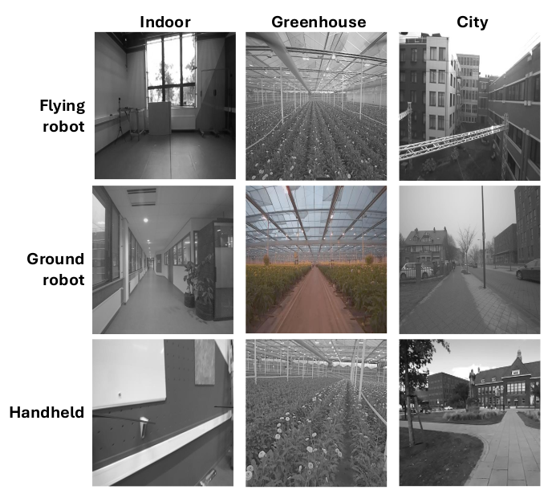

# SMARTNav: A Visual-Inertial Dataset for Reliable Robotic State Estimation

In this webpage, we present the SMARTNav dataset, which stores the raw sensor data recorded by aerial and ground robots. The data was collected as part of our projects that address the challenges of autonomous navigation in industries where autonomous robots are needed. This data was mainly recorded for the evaluation of Visual-Inertial Odometry (VIO) algorithms; however, it can be used generally for vision or LiDAR-based SLAM and fusion algorithms. 

## Downloads

| Seq. Name            | Size (GB) | Topics          | Link            | Snapshot          |
|----------------------|-----------|-----------------|-----------------|-------------------|
| greenhouse_flight_3  | 6.1       |  | [SRCD](https://saxion.data.surf.nl/s/M9G9wbXzKrdPriS)    |  |
| greenhouse_flight_5  | 3.1       |  | [SRCD](https://saxion.data.surf.nl/s/zSRpbPBHksaHocd)    |  |
| greenhouse_ground_1  | 7.3       |  | [SRCD](https://saxion.data.surf.nl/s/4rnGxWidfxT5EYS)    |  |
| greenhouse_ground_2  | 7.7       |  | [SRCD](https://saxion.data.surf.nl/s/kGWn4RYmCQTcWaj)    |  |
| greenhouse_handheld_1| 2.4       |  | [SRCD](https://saxion.data.surf.nl/s/88A8rMdRibqJZHm)  |  |
| optitrack_flight_1   | 0.5       |  | [SRCD](https://saxion.data.surf.nl/s/RfQmLQZKFdqdX54)     |   |
| optitrack_flight_2   | 1.7       |  | [SRCD](https://saxion.data.surf.nl/s/gYbayyCDCtLbe3z)     |   |
| optitrack_handheld_2 | 1.1       |  | [SRCD](https://saxion.data.surf.nl/s/yqGLFda3G896iq8)  |  |
| optitrack_handheld_3 | 1.1       |  | [SRCD](https://saxion.data.surf.nl/s/AY5BQQArnmggqka)  |  |
| outdoor_flight_3     | 2.5       |  | [SRCD](https://saxion.data.surf.nl/s/a62gc3r36eH6S2D)       |      |
| outdoor_flight_4     | 6.8       |  | [SRCD](https://saxion.data.surf.nl/s/pepbt3SKPwNjYFC)       |      |
| outdoor_flight_5     | 8.7       |  | [SRCD](https://saxion.data.surf.nl/s/YdkaRbLxTSWwzTm)       |      |
| outdoor_flight_6     | 3.5       |  | [SRCD](https://saxion.data.surf.nl/s/HJaLcCgGGPdeiDq)       |      |
| sidewalk_ground_1    | 35.9      |  | [SRCD](https://saxion.data.surf.nl/s/nFdt4KLQiNpt5ap)      |     |
| corridor_ground_1    | 25.8      |  | [SRCD](https://saxion.data.surf.nl/s/799dYzRYwaXZrmi)      |     |

