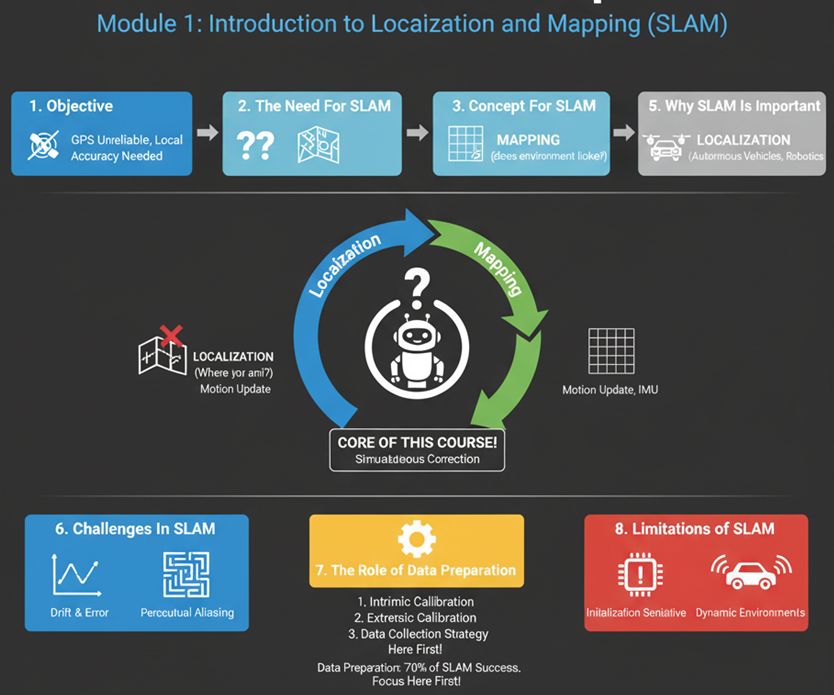
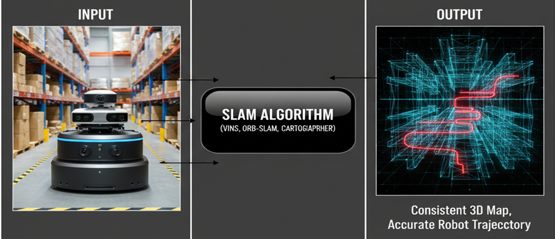
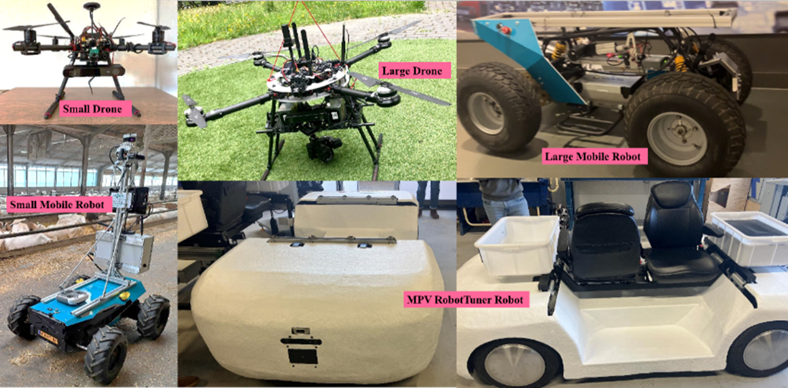

# Chapter 1: Introduction to SLAM

## 1.1 Objective

 Figure 1 illustrates the topics that will be discussed in this chapter. After completing this chapter, participants will be able to:

- Understand the concept and purpose of SLAM in autonomous systems.

- Explain why SLAM is important for robots.

- Identify key challenges and limitations of SLAM in real-world applications.

- Recognize the role of data preparation in achieving successful SLAM results.

  
  

    <em>Figure 1: Illustration on the topics to be highlighted in this chapter.</em>
  

## 1.2 Introduction: The Need for SLAM

Autonomous navigation has become one of the central capabilities of modern robotics. Whether it is a drone flying indoors, a warehouse robot delivering packages, or an autonomous robots driving through city streets, they faces the same two fundamental questions:

*Where am I? (**localization**)*

*What does my environment look like? (**mapping**)*

The process of answering these two questions at the same time is called *Simultaneous Localization and Mapping (SLAM)*. SLAM allows a robot to build a map of an unknown environment while simultaneously determining its position within the so-far built map as simply demonstrated in Figure 2. In human terms, imagine entering a dark, unfamiliar room with no GPS or prior map. You start walking slowly, feeling the walls, and mentally building a map while estimating your position relative to it. This is essentially what a robot must do in a new environment (called *Navigation*).

SLAM enables a robot to construct a map of its surroundings while simultaneously tracking its own motion within that map based on data from onboard sensors such as cameras, LiDAR, and inertial measurement units (IMUs).

  
  

    <em>Figure 2. SLAM is very necessary to enable robots to conduct navigation and collect data.</em>
  

## 1.3 The Concept of SLAM

SLAM is fundamentally a state estimation problem. It involves estimating the robot’s pose (position and orientation) and a model of the surrounding environment from sequential sensor data/frames. Thus, the SLAM process involves two tasks as shown in Figure 3:

- **Localization**: Determining the robot’s position and orientation within the environment.

- **Mapping**: Creating a representation (map) of the environment based on sensor data.

Both tasks depend on each other and the robot cannot accurately localize itself without a map, and it cannot build a correct map without knowing its position. SLAM solves this problem by using probabilistic estimation and continuous updates as the robot moves.

Inputs:

- Sensor measurements (images, LiDAR scans, IMU data)
- Control or motion inputs (wheel odometry, velocity commands)

And outputs:

- The **trajectory** of the robot (motion over time).
- The **map** of the environment.

Although many SLAM algorithms exist (filter-based, optimization-based, graph-based, etc.), this course focuses on the conceptual understanding and engineers will treat SLAM as a **functional system**  (a black box that takes in properly prepared data and produces a map and trajectory as outputs).

  
  

    <em>Figure 3. SLAM techniques take robots' sensory data as inputs and produce maps and trajectories</em>
  

## 1.4 SLAM Pipeline

The SLAM system is generally divided into two main processes that work together:

**The Front-End (Real-Time)**

It is responsible for data ingestion, feature extraction, and local motion estimation to estimate the robot's pose (position and orientation) and construct the initial local map structure. This process needs to be fast and accurate.

**The Back-End (Optimization)**

It is responsible for error correction, data association, and global consistency of the entire map and trajectory. It relies heavily on detecting when the robot revisits a place (Loop Closure). It should be less fast than front-end process but more accurate to correct all position errors with respect to the realworld. Different optimization methods could be used based on the sensor data and the tyoe of maps needed for the industrial application, e.g., 2D or 3D, dense or sparse, accurate or feasible and so on.

  
  

    <em>Figure 4. SLAM main and general pipline.</em>
  

## 1.5 SLAM Importance

SLAM is the foundation of autonomous perception and navigation. Without it, robots cannot move intelligently in unknown areas. It provides the spatial awareness required for tasks like path planning, obstacle avoidance, and environment understanding.

**Practical applications include:**

- **Autonomous vehicles**: Navigating complex roads and cities.

- **Aerial drones**: Flying indoors or in GPS-denied areas.

- **Service robots**: Operating in factories, warehouses, greenhouses, forests, seas, underwater and so on.

- **Exploration robots**: Planetary rovers, underwater vehicles, and subterranean robots or planetary surfaces.

  
  

    <em>Figure 5. SLAM can be integrated into different robotics platforms for various purposes.</em>
  

## 1.6 Challenges in SLAM

Although SLAM may seem a straightforward conceptually, real-world conditions make it challenging such as introducing uncertainty, noise, and dynamic changes that complicate both the trajectory estimation. Engineers and researchers should deal with uncertainty, noise, and incomplete data to produce reliable, robust and scalable applications. 

**Common challenges include:**

- **Sensor Limitations**

Cameras struggle in low light or with motion blur.

LiDARs fail on reflective or transparent surfaces.

IMUs drift over time if not corrected.

- **Environmental Complexity**

Dynamic objects (people, cars, doors, robots) create false data associations.

Repetitive or featureless environments (white walls, glass) make feature tracking unreliable.

Changing lighting or weather affects visual perception.

- **Data Association Errors**

Recognizing the same place from different viewpoints is difficult.

Wrong associations cause mapping errors or loop closure failures.

  
  

    <em>Figure 6. Real and practical challenges of applying SLAM in industrial settings.</em>
  

## 1.7 Limitations in SLAM

Even with advanced algorithms, SLAM has inherent limitations that engineers must understand before deploying it in real systems.

- **Dependence on Sensor Quality:**
The accuracy of SLAM depends entirely on the data it receives. Low-cost sensors can introduce noise and distortions that degrade performance.

- **Accumulated Drift:**
Over long trajectories, small errors in motion estimation accumulate, leading to inconsistencies unless corrected by other resources such as GPS fusion.

- **Computation and Memory:**
Large-scale mapping requires significant computational resources, which may not be available on small mobile robots.

- **Calibration Sensitivity:**
Calibration ensures to produce geometric consistency by sensors such as camera or lidar. Moreover, misalignment between sensors (e.g., between a camera and an IMU) can severely affect results.

**Understanding these limitations helps engineers to design systems that work with SLAM rather than expecting it to solve all navigation problems perfectly.**

## 1.8 The Role of Data Preparation

The most underestimated aspect of SLAM is **data preparation**. The success of any SLAM system depends critically on the quality of the input data. A well-prepared dataset makes SLAM robust, while poor data can make even the best algorithm fail.

In this course, data preparation refers to three main steps: **sensor selection**, **calibration and data collection** strategy.

- **Sensor Selection**
- Choose sensors based on the operating environment.

- Cameras are small and affordable but require good lighting.

- LiDARs provide accurate 3D structure but are heavier and costly.

- IMUs provide motion cues but drift quickly.
A combination (e.g., visual-inertial or LiDAR-inertial) is often used.

- **Calibration**

- **Intrinsic calibration**: Corrects for lens distortion and optical errors.

- **Extrinsic calibration**: Defines spatial relationships between multiple sensors (e.g., between a camera and IMU).

- **Deployment and Data Collection Strategy**

- Understand the operational environments and relevant challenges of robot navigation.

- Select the most appropriate SLAM method that aligns the determined challenges.

- Move the robot smoothly, avoid abrupt rotations, and capture diverse views.

- Plan trajectories that include revisiting some areas.

- Clear interpretation of the collected data and the outputs. 

  
  

    <em>Figure 7. The data preparation is the keypoint to ensure high quality and robust results by SLAM techniques.</em>
  

## 1.9 Summary

SLAM represents a cornerstone of autonomous navigation and perception. This chapter introduced the brief concept of SLAM, discussed its importance, examined common challenges and limitations, and emphasized the critical role of data preparation. Successful SLAM operation relies not only on algorithmic sophistication but also on well-prepared and accurately calibrated sensory data.

The subsequent chapters will expand on practical aspects of data acquisition, calibration techniques, and data preperation for ensuring high-quality SLAM performance.