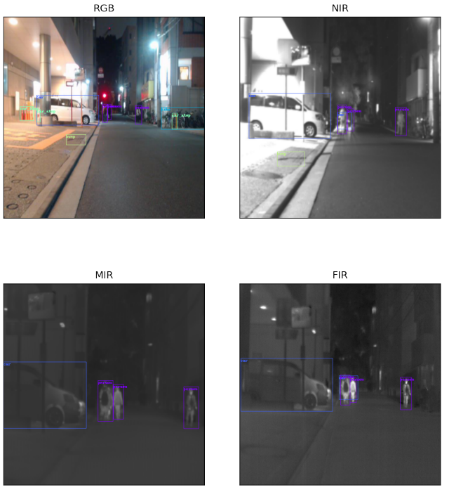
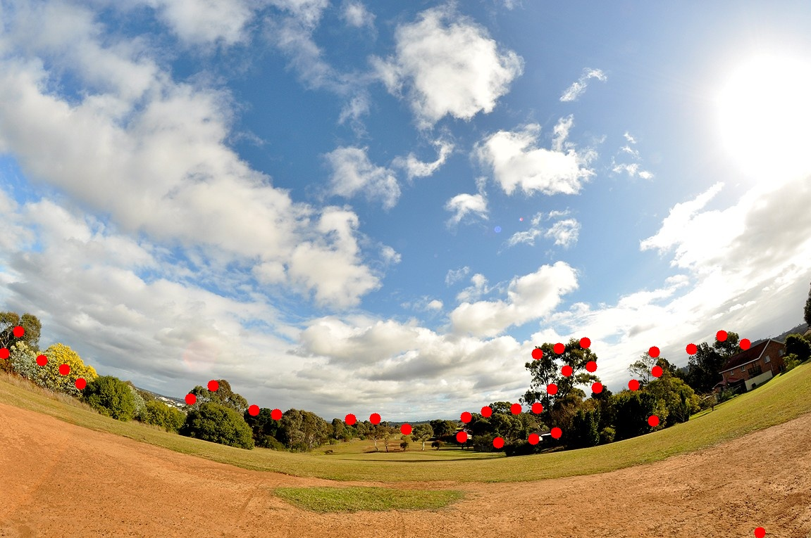
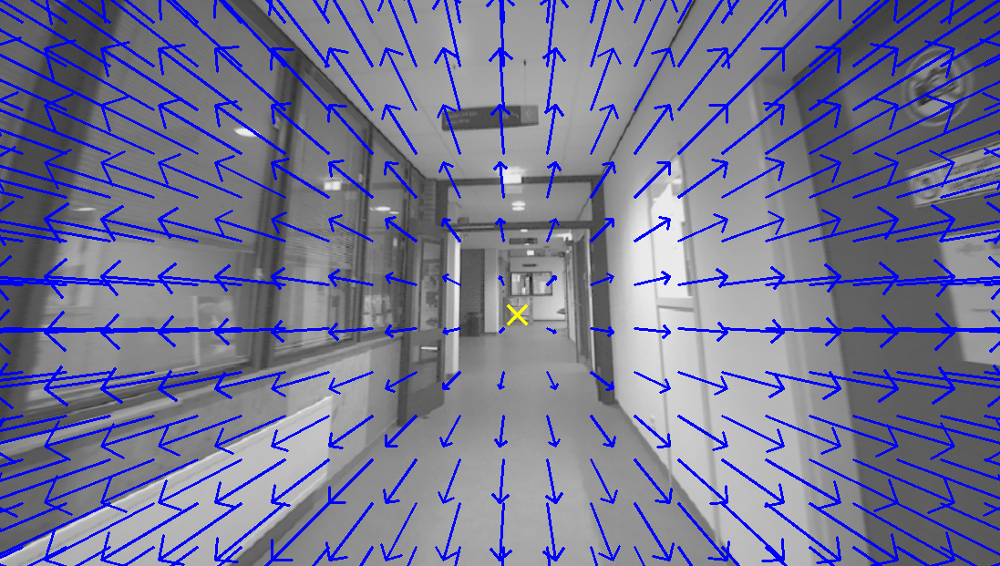
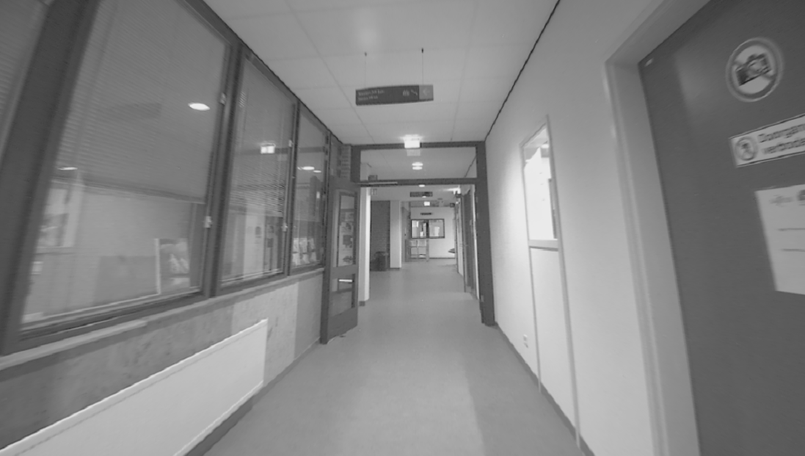
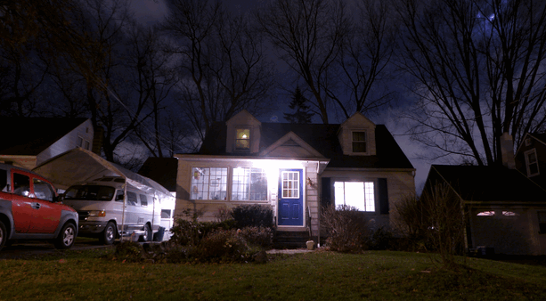
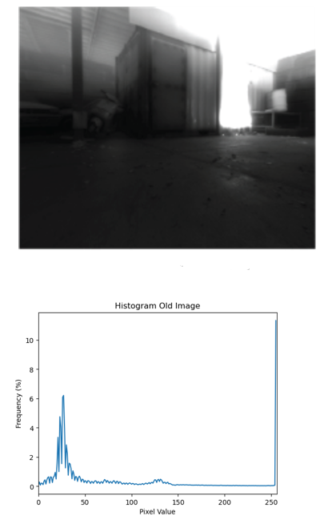
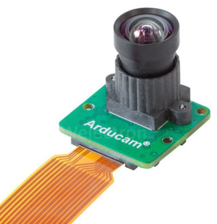
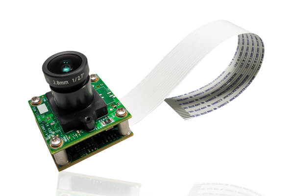
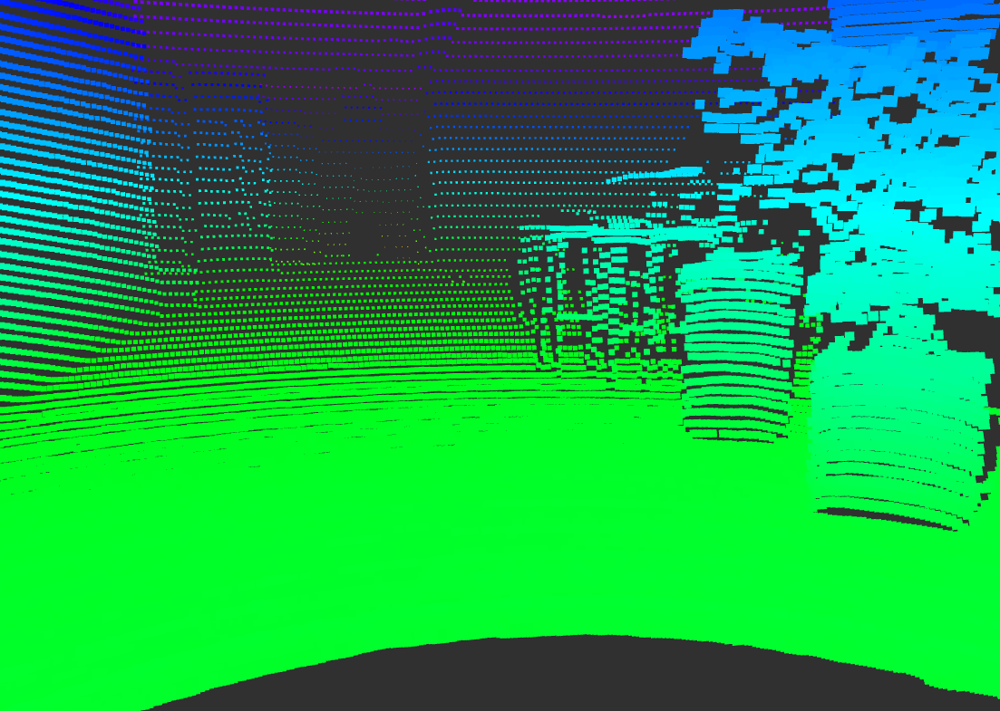

# Chapter 2: Sensor Selection for SLAM

## Objectives
The objective of this chapter is to get an introduction to different sensing modalities that are common in SLAM. Furthermore, we will discuss advantages and disadvantages of each sensing modality.

At the end of this chapter, it is expected that the reader will be able to:
- Identify the suitable set of sensors for their application
- They will be familiar with the common trade-offs regarding the SLAM sensors, including the trade-offs between accuracy, cost, computation, environment, and maturity of algorithms.
- They will have an idea of which specifications to consider when choosing sensors for SLAM

## Role of Sensors in SLAM Architecture

SLAM often has two separate internal components, namely the front-end and back-end. 

**Front-end**: It is the module that turns raw sensor measurements of sensors into an intermediate representations that are more compact and informative about robot's or environment's state.
For example, if a camera sensor is used for SLAM, it outputs images at a resolution of let's say 640x480. This means that we will have 307200 pixels each conveying some information about the environment. This is an enormous amount of information that is very difficult to comprehend and use. Hence, we need a set of processes to filter out this information and only extract a minimal set of relevant information that are insightful about robot's motion and states.

**Back-end**: It is the core algorithm, usually in the form of optimization or filtering, that takes the intermediate representations and outputs the robot's location and environment's map. The details of SLAM backend is not the focus of this course.

As evident from the above definitions, choice of sensor defines the SLAM front-end architecture.

## 2.1 Cameras for SLAM

### 2.1.1 Image
If you have previous experince with compputer vision or image processing, you can not find a more obvious information other than explaining what an image is! Otherwise, it is worth introducing you to the direct product of a camera. An image in computers is represented as a matrix of numbers. Each cell in the matrix is called a pixel, a discrete piece of infomation, determining how a tiny portion of the view looks like (Figure 1). As such, it must be intuitively easy to imagine that the higher the number of tiny pixels besides each other, the more clear picture of the view will be formed.

|  |
|:--:|
|*Figure 1: Pixels, the building blocks of an image.*|

### 2.1.2 Camera modalities
Cameras come at many different measurement modalities, such that the images they form will look different or measure different thing. The cameras that are usually common in robotic applications such as SLAM are mostly covering the visible light wavelengths. Figure 2, portrays the electromagnetic spectrum, and the whereabouts of the visible part of the spectrum (rainbow section) clearly indicates the target wavelengths that the cameras usually measure.

|  |
|:--:|
|*Figure 2: What each sensing modality of cameras measures.*|

**Color cameras**: These cameras are meant to capture a scene exactly in the most similar manner to the way we see the environment, by presenting the information in different shades of colors. In order to understand an important characteristics of the cameras that can be influential is robot perception and navigation, we must delve a bit deeper into how cameras work.

In the spectrum of the Figure 2, the wavelengths between  380-700 nm is covered by color cameras. However, the way that a color camera can capture the actual color is through a specific mechanism. In fact, a color camera is able to measure 3 values for each pixel, i) the intensity of the blue ii) green and iii) red colors. The sensitivity of the pixel to each of these colors, follows the distribution presented in Figure 2. For instance, a color corresponding to the frequency 400 nm, will mostly excite a blue color and less green and much less red.

However, the capturing of these 3 numbers at the same time follows an interesting engineering trick in the design of color sensors. As depicted in Figure 3, color cameras don’t record three color numbers per pixel directly. Instead, a color filter array (CFA), most commonly the Bayer pattern, places red, green, or blue filters over individual sensor pixels in an alternating mosaic (Figure 3). Each pixel measures only one color component, and the camera later uses demosaicing (e.g., nearest-neighbor, bilinear, bicubic, or more advanced methods) to reconstruct full RGB values for every image pixel. The Bayer pattern includes twice as many green filters as red or blue because luminance (perceived detail) is largely carried by the green channel, so oversampling green improves sharpness and noise performance (the choice also aligns with human visual sensitivity). The filters themselves pass only the corresponding wavelength ranges for R, G, and B (see Figure 2). Please refer to [this reference](https://ieeexplore.ieee.org/document/1407714) for more details.

|  |
|:--:|
|*Figure 3: Comparison of monochrom and color camera mechanisms for capturing the image.*|

**Monochrom**: Unlike color cameras, there is no filter arrays needed for different pixels. In monochrom cameras, all the pixels are used for capturing some portions of the scene, thus the full potential of the physical pixels of the camera is used to capture the scene details, and no approximation through interpolation is usually needed. This is further depicted in Figure 3 by comparing these two sensing modalities.

Another consequence of the color filters is that, they narrow down spectrum of the incoming rays of light, only passing a rather narrow band (related to the R, G, or B color). In Figure2, we have tried to show the range of wavelengths that are covered by R filter, G filter, B filter, and finally no filter (monochrome). These are approximation curves and they slightly differ for each real sensor. These curves are usually provided by the manufacturer. As is evident, a monochrome sensor (gray curve), covers a wider range of spectrums compared to the combination of R,G,B filters together. Specefically, it covers more on a portion of the infra-red band, also known as near-infrared. As a result, each pixel will receive less share of light rays (photons so to say); however, a monochrom camera due to lack of the filters can receive more light rays and is more illuminated compared to RGB cameras, improving performance at the darkness.

|  |
|:--:|
|*Figure 4: Comparison between images taken from different ranges of electromagnetic spectrum. Image taken from [https://doi.org/10.48550/arXiv.2108.11767](https://doi.org/10.48550/arXiv.2108.11767)*|

To make the discussion more sensible, Figure 4, brings a comparison between images taken from different electromagnetic bands. For instance, the RGB camera captures nice representation of the lit parts of the scene, also providing more semantics through the color information. However, the same scene captured using a monochrom camera that also captures some light in near-infrared (NIR) band can show more of the shadowed section of the scene, while providing a good geometrical understanding of the lit portion, yet missing the color details. The more the camera moves towards higher wavelengths (more towards middle-infrared and far-infrared) the more it turns into a thermal camera, seeing better at darkness and sensing the heat, yet the more specialized the sensors become that comes at a higher cost.

### 2.1.3 Camera configurations

**Monocular camera**: It captures image data through a single lens. The benefit is that it is the most compact and efficient sensor setup in robotics, and SLAM systems. The drawback is that, this makes it more complicated to understand the geometry of the scene. 

Intuitively, it is not possible to understand the other dimensions of the real-world objects (also known as depth estimation), unless you observe them from at least two different points of view. This 3D understanding about the surrounding objects is central to the SLAM methodologies. Using only a single camera seems to prevent us from understanding the distances of the scene components from us; however, there are a few tricks that will enable depth estimation even using monocular cameras.

The traditional approach is to move the camera around and use the observation of the same object in multiple frames at different times. Although the depth estimation will not be at hand at every frame, but after some time, assuming sufficient spatial translations, we should be to look at the same targets from different angles. This allows us to do simple geometrical analysis also known as *Triangulation* to measure objects' distances from the camera.

There is a more recent approach to solve the monocular depth estimation problem, which is taking advantage of deep neural networks. These networks are trained using massive datasets, learning how to estimate the relative distances of object from camera only using a single image. This depth estimation based on experience is kind of similar to the way a human can infer depth if he covers one of his eyes, such that he still can understand distances but mostly because of experience. 

**Stereo camera**: If two monocular cameras are attached together, such that they share most of their view, it is a stereo camera setup. This is very similar to human way of observing the environment. In this setup, at every timestamp, the calculation of the scene depth is possible, since we already have two different views of the object. Simlar triangulation techniques, or more complicated methods are possible to be used here. The accuracy of the output depth estimation relies on many factors such as the algorithm. The maximum range of depth estimation depend on how separated the two cameras are from each other (also called the stereo baseline). 

|  |
|:--:|
|*Figure 5: The comparison between monocular and stereo cameras in terms of 3D scene understanding.*|

In the Figure 5, examples of monocular and stereo cameras are highlighted. As evident, for a monocular camera, only by having dicplacements with respect to an object in the scene (the star shape represents an object), it is possible to create a virtual stereo camera by putting together the pairs of images from different times (given that they are far apart sufficiently). Then, a triangle can be assumed, however, all three side of the triangle are unknown, yet using two consecutive computer vision methods, namely the *Five Points* method, then *Perspective n Points*, a value for these sides will be at hand which is proportionally correct, however, does not have the right metric scale. The details for these algorithms is for interested readers. At the end, it should be emphasized that the monocular camera can not yield the right metric values for the depth of the features and only can deliver values for distances of objects that are correct relative to each other (correct proportions). If we want to convert them to correct metric values, another hint (another sensor such as IMU) should be incorporated.

By comparison, the stereo camera in Figure 5, forms a similar triangle, however in one time instance and not across two different time instances. Moreover, the triangle that is formed for on object in the scene, has one known side (which is the baseline since we know how much apart are the two cameras from each other). As such, an easier triangulation with correct metric scale is possible without the need for additional hints.

### 2.1.2 Camera-based SLAM Front-end
Cameras provide the richest set of information among the available solutions for SLAM. The real challenge of using and dealing with camera is how to extract the necessary information out of them.

When you choose cameras for your SLAM problem, you will often end up with a general architecture. We depict this general architecture in Figure 6. It does not mean that all SLAM algorithms are exactly following this architecture, but gives a general ideea of what happens in the camera-based SLAM.

|  |
|:--:|
|*Figure 6: Camera-based SLAM architecture. Taken from the `robor_test_3` sequence in SMARTNav dataset.*|

As emphasized previously, cameras spit out a lot of pixeled data. The first step is to *Extract Features*, ie. only keep the information that are necessary and useful. In Figure 6, you can see that some common ways of extracting features are depicted. For instance, extracting the edges in the picture, or extracting feature points (mostly the corner or sharp points in the environment that are easily detectable), or even lines are detected and extracted from image. These are popular feature extraction techniques because of two main reasons. I) It is relatively easy and quick to identify these features using classical computer vision II) It is possible to track these features accross different consecutive image frames. Among these intermediate representations, feature points are the most comonly used method.

After feature extraction, it is important to maintain a unique identity for the features across different frames. As an example, if you see the corners of the ceiling of the house, in Figure 6, as a unique feature in the environment, you should be able to detect the same spot at a few moments later and you should be able to understand that this corner is the same that you saw before. If you successfully do this, you have performed a correct *Feature Tracking*. Figure 6, also shows an example depiction of feature tracking, where the features are tracked across two consecutive image frames. The location of these features in the first and second frame is drawn by the red dots and the green lines have established a connection between the latest and former location of the features.

Although, the tracking of the features of environment is essential to the SLAM, providing a sense of relative motion with respect to the environment, it is not enough to realize a 3D measuremt of motion. The feature points should not be only tracked in the 2 dimensional space of the image, but also their 3D location in the space must be determined. So for each feature point, we can estimate a 3D location from the images, that is not trivial, but achievable through either monocular or stere-based camera configurations. In Figure 2, the uplifting of 2 dimensional features from image space into the 3D space is visualized such that a metric distance between the camera and the spatial position of that feature is at hand.

### 2.1.4 Sensor requirements (what to buy & why)

The camera to be used in SLAM should have specific characteristics, some of which are listed in the table below. Note that some of more detailed specs are useful when a custom camera sensor and lens is being selected, while many cameras used in robotics, have a good trade-off between these specs.

- **Field of View (FOV)**:
For SLAM methods, a high FOV, is usually desireable, to see a higher number of features at the same time in the environment, and to be able to pick best features to track. To avoid being blinded or obstructed. It is worth noting that very large field of view (above 120 degrees) will be a bit challenging for calibration (one step before deploying your SLAM) such that the available open-source calibration tool will have difficulties yielding accurate calibration results.

|  |  |
|---|---|
|*Figure 7: Visualization of the difference between narrow (left image) and wide (right image) FOV, and its effect on feature tracking.*|

Figure 7, compares the effect of having a wider FOV. The red dots are the spots in the image that usually considered as feature points in a the SLAM front-end, and they are extracted using a common feature detection algorithm used in many SLAM methods. In the wider FOV image, it is usually easier to have higher quality features (unique corner points for instance), while in the low field of view, the algorithms has to rely on lower quality features (like the many points insie the trees that are less unique) to maintain a required number of feature points. The other difference is that while having the wide FOV, in order to lose sight of all these features at once, you should have a larger sudden motion from the camera. The drawback of the wide-FOV lenses usually is in the form of the distortion of the image. The straight lines, and planes are curved, speceially close to the borders of the image, and the higher the FOV, the more spherical pattern is induced on the image. These distrotions have to be rectified in the calibration stage.

- **Resolution**:
Low resolution can prevent visual SLAM from proper tracking of features. High resolution will introduce unnecessary processing loads to the system, specially keeping the buses (USB for instance) busy, making it difficult to record the data, and adding more delay in position tracking and map updating due to time taken for tracking feature in images. 

- **Shutter**:
Global shutter sensors are ideal for visual SLAM to minimize motion blur. To eliminate rolling shutter effect, that skews moving objects in the image and give unrealistic depiction of scenes in case of motion. Interesting to note that rolling shutter is in contrast with image resolution due to limitation in the technology behind rolling shutter, such that if you want a high-resolution rolling shutter sensor, the price increases. However, most of the cheap rolling shutter camera have an adequate resolution for our application.

|  |  |  |
|---|---|---|
|*Figure 8: Comparison between the image taken from a global shutter camera (left) and the one taken from rolling shutter (right) due to the motion pattern in scene (middle). The image is taken from the `corridor_ground_1` sequence in SMARTNav dataset.*|

The difference between the image taken from a roller shutter and one taken from global, is illustrated in Figure 8 (the effect is simulated on the rolling shutter image). As evident, the distortion cause by motion, make the rolling shutter image to yield an undrealistic representation of the scene (all the vertical line are bent closer to the edges) along with more blurring on high-speed parts in the image. The amount of rolling shutter effect is dependent on the magnitude of speed. Meaning that in applications that the robot is moving slow or high magnitude and high frequency vibrations are not expected, this effect might be negiligle, however, for more dynamic use cases, a global shutter sensor is advised.

- **Data Rate**:
A higher streaming rate of the camera can help in fast motion so that the feature tracks dont get lost. Here, by high we mean higher that the norm in most of the cameras which is usually 30 Frames per Second (FPS); while having an excessively high FPS (> 90 FPS) might be unnecessary due to the fact that most of the SLAM will not be able to handle this high frequency stream of data and they have to drop some of the frames to keep up.

- **Dynamic Range**:
Dynamic range indicates the ability of the camera to capture details in dark or bright areas of an image. It is defined as the difference between brightest light and darkest dark in the image. Any light above this range will be diplayed as white and anything below it is pitch dark. This difference is also visible in Figure 9.

|  |  |
|---|---|
|*Figure 9: Difference beween low dynamic range (left image) and high dynamic range (right image) cameras.*|

- **Bit-rate**:
The normal image data that is given by cameras is an array on 8-bit pixels. This means that each pixel value can be reported by a combination of 8 zeros or one. As a result, each pixel might have $2^8 = 256$ values. In simpler terms, a normal 8-bit camera can capture colors in 256 different shades.
If we can capture higher bit-rates such as 10, the number shades we can capture will be immediately increased to 1024, which translate to far more details in cases that the lighting of the environment is uniform (dark for instance) or the textures have very close colors.

|  |  |
|---|---|
|*Figure 10: An example of an 8-image in a low light environment.*|*The example of a 10-bit image from the same environment. The image taken as part of the [firefighting robot](https://www.saxion.nl/onderzoek/smart-industry/smart-mechatronics-and-robotics/firebot) within the SMART group.*|

The above figure shows on the left side an image that was captured and converted to 8-bit format (256 shades). For this image a hostogram of different pixel values is drawn as well. As visible in the histogram, most of the pixel color are concentrated in one small region, meaning that all colors in the image are close to each other and having a general dark vibe. On the right side, all 10-bit (1024 shade of color) where used. The important thing to note is that our displays and most of computer vision functions are not able to process the higher bit-rates that 8, meaning that an algorithm should be used to convert this higher bit-rate to 8, while maintaing and intensifying the details. The exact details about such an algorithm is beyond this guide, but as a comparison, you can see the result of a better use of extra shades of color and a correct conversion in the right image of Figure 10.

- **Lens**:
This item mostly depends on how custom you want your sensor setup to be. If you want to be able to keep your core sensor (resolution, shutter, rate, and connection remain the same) but you want to be able to change or experiment with different FOVs, you can go for a sensor that allows you to change the lens. This information can be found in the datasheets of the sensor, for instance an m-12 lens mount is an ideal option in the market, while those that are mentioned to have a stock lens are not changeable.

|  |  |  |
|---|---|---|
|*Figure 11: A camera with an unchangable stock lens (left), one with an M12 mount (center), and different options for lens yielding different FOVs and sometimes difference frequency band cuts and IR filters (right).*|

- **Connection**:
Flat cable connection to the onboard computer (Jetson) help with faster data transfer and reduces undesirable delays and bandwidth limitations of the USB port. However, they are ideal when the camera is close to the processor board, otherwise, these cable do not have the needed flexibility and USB3 interface will be more ideal as a balance between data transfer speed and design flexibility. USB2 camera are not very desireable for SLAM and generally embedded vision applications. When making the decision about going for a USB3 camera or a camera with flat cables, other than the mechanical design aspects, the compatibility with the processing unit (whether the embedded computer has relevant port) should be taken into account.

|  |  |
|---|---|
|*Figure 12: Example of a camera having a USB connection (left) and a camera with flat cable connection (right).*|

- **Pixel size**:
The higher the pixel size, the better low light performance.

- **Optical size/format**:
In case you go with an adjustable lens option for the sensor, you should make sure the the optical format provided in lens and sensor are compatible. This size determines the effective area of sensor that captures the scene. If it is smaller than that of the lens, a big part of the scene taken by lens will go out of image boundaries. If it is larger than that of lens, a big dark area will appear around the captures scene in the final image.

- **Driver**:
When buying a camera, if the vendor provides you with a driver that is compatible with embedded computers (usually having aarch64/arm64 processor architecture as opposed to amd64 which is common in the desktops) and if they have a ROS2 wrapper for their sensor, it is going to make life much easier and it will be mostly plug and play. 

### 2.1.6 Available solutions (examples)

 In the table below, we bring a few example of some commonly available cameras in the market, and compare them base on the discussed criteria.

| Camera | Modality | Horizontal FOV | Max resolution | Shutter | Max FPS | Dynamic Range (dB) | Max bit rate | Lens | Connection | Pixel size ($µm^2$) | Driver |
|:--------|:--------|:--------|:--------|:--------|:--------|:--------|:--------|:--------|:--------|:--------|:--------|
| Realsense D455 | monochrome | 87° | 1280 × 800 | global | 30 | - | 10 | fixed | USB 3.1 | 3 x 3 | Embedded Linux and ROS2 support |
| ZED 2          | color | 110° | 2208 x 1242 | rolling | 100 | 64 | 8 | fixed | USB 3.0 | 2 x 2 | Embedded Linux and ROS2 support |
| ZED X           | color | 110° | 1920 x 1200 | global | 100 | 71 | 8 | fixed | GMSL2 | 3 x 3 | Embedded Linux and ROS2 support |
| Raspberry Pi Camera Module 3 Wide           | color | 102° | 4608 × 2592 | rolling | 60 | up to 96 in HDR mode | 10 | stock lens | Flat cable | 1.4 × 1.4 | Embedded Linux support |
| Arducam multi-cam board with OV9282 base sensors           | color | adjustable | 1280 × 720 | global | 150 | 68 | 10 | M12 mount | Flat cable | 3 × 3 | Embedded Linux support |

We assigned characteristics of the mentioned sensors in either green or red, a harsh thresholding that of course can vary based on specific applications. For instance, if you prefer having a colored 3D map of the environment, monochrome sensors are probabely not what you are looking for. In this version of the table, we preferred low light performance, thus the monochrome is marked as green and colored sensors are red.

Another improtant thing to note is that the maximum of some of these specifications does not happen at the same time. For instance, the max resolution usually leads to a lower FPS than the max FPS reported in the table. However, when we set some of the maximum resolutions to red, it means that for a typical SLAM application with most of the available open-source method, such high resolutions are an overkill and can needlessly increase the sensor price. 

There are other consideration related to these cameras at the marker, such as out of the box softwares that can give you additional functionalities. For instance the ZED cameras and Intel Realsense, usually have yield an out of the box depth estimation which can be useful in some SLAMs. However, in some cases such as the ZED cameras, it adds another requirement which is GPU-equipped embedded computers (such as Nvidia Jetson family).

In a nutshell, for a beginner-level introduction to the world of SLAM or generally computer vision, ready-to-use options such as ZED cameras or Realsense D455 is a good choice.
For having more control over the sensor and customizing to your robot, while having maximum control over the suitability of the sensor, custom sensor boards such the Arducam is an attractive option.

### 2.1.8 Advantages and disadvantages of visual SLAM
There are many advantages to the cameras, that make them a suitable choice for SLAM in robotics. 
- They are rich. They see almost everything that a human doest.
- They are usually lightweight, that makes them perfect for robots which weight is a determinig factor.
- They are also energy efficient.
- Inclusion of the cammera has the minimum design burden compared to LiDAR, RADAR, Compass, GNSS, and even the IMU. Meaning that they can be put flexibly on any part of the robot without much constraint on your design.
- They can be used for other purposes. For instance you can put a camera for running your SLAM but also you can use the stream of image to perform another vision task, such as identifying a subject.
  

The cameras also come with some disadvantages:
- They are not able to directly understand the geometry of the scene. Understanding the geometry of the scene (how far things are from the camera) is necessary in SLAM and there are techniques to understand the distances but these techniques are not 100% reliable and have many limitations such as range and the textures in the environment.
- The volume of data that is to be handled by camera is relatively high.
- Due to the handling of the camera data, they often introduce delay to system, happening at the data transfer from sensor to the computer and copy pastings at Operating System (OS) level.
- The SLAM algorithms that use camera are usually heavier than the ones using other modalities. This further processing often happens during feature extraction and 3D understanding of the environment
- Normal RGB cameras dont see at darkness. 
- There are some challenges related to SLAM algorithms such as the motion blur in very dynamic cases. Also in environments with no texture (flat uniform surface or reflective surfaces), the visual SLAM perfrom poorly. Although we introduced some paramters in this section to have a camera with good performance in challenging lighting conditions (low light for instance), however, there are limits to what camera can clearly see.
 

---

## 2.2 LiDAR for SLAM

LiDAR stands for Light Detection and Ranging, a technology that is less broad and generic compared to cameras, and is often more suitable and specialized for robotic applications.

### 2.2.1 LiDAR Mechanism
LiDAR operates based on the principle of sending out a laser beam at a very specific and narrow direction in space, and also waits for the reflection of that beam, then, based on the traveling time of the beam (also known as Time of Flight or ToF), having the speed of light in mind, it measures the distance of the nearest object in that direction of the space.

This ToF-based range measurement usually occurs multiple times and for multiple directions in space, giving an estimation of the environment geomitrical shape.

|  |
|---|
|*Figure 13: The concept of LiDAR mechanism taken from [LiDAR Wikipedia](https://en.wikipedia.org/wiki/Lidar). On the top, a simplified design for LiDAR sensor is displayed, including the laser source and the rotating mirror that reflects the beam in different spatial directions. In the middle figure, the top view of the space around the sensor is shown in form of rectangular room with the LiDAR (blue rectangle) and another round object (green circle). After capturing the time of flight for the beam in each direction and measuring the distance, a 2 dimensional map can be formed as displayed in the bottom image.*|

### 2.2.2 Pointcloud
Just like the cameras that output an image as their data format, LiDARs produce pointclouds. A pointcloud is a set of 3D points in space. These points have $x, y, z$ coordinates. These are points in the coordinate frame of the sensor, meaning that they are relative to the sensor itself and still do not have any spatial meaning relative to a world-related reference frame. In fact, making sure that these points are coordinates in a world related reference frame is one of the tasks that our SLAM will do.

|  |  |
|---|---|
|  |  |
|---|---|
|*Figure 14: Visualization of LiDAR pointcloud taken from the `corridor_ground_1` sequence of the SMARTNav dataset.*|

The immidiate outputs of a LiDAR sensor are depicted in Figure 14. The top left image, is a camera image, to give you an understanding of how the environment in front of the robot is supposed to look like. The top right is the 3D pointcloud of the environment. This pointcloud is measured by a LiDAR sensor that has a 360 view, so it sees more than just the front of the robot (unlike the camera). The robot is actually located in the middle of the empty circle. By comparing the geometry of the scene as a human can percieve from the image, you can observe that pointcloud is almost perfectly resempling the area around the robot. The colors of each point is based on its height, where the higher point have a more reddish color. In bottom left you can see the pointcloud closely from camera's point of view, and it is more evident that the 3D geometry of the scene matches the camera image. In bottom right, is another top view, but this time it can be observed that the density of the points is increasing with the distance from the sensor. So a LiDAR sensor has a much denser representation of the scene at its vecinity compared to farther points.

### 2.2.3 Configurations (data patterns)
LiDAR mechanism and technology is used in different design configurations. Having a general understanding about these designs can help to  identify the best option for each application.

- LiDAR Range Finders:
  This is the simplest version that only measure the distance in one spatial direction and is not often used in SLAMs but very common in robotics especially the aerial robots. For instance it can be attached to the bottom of a drone to measure a more accurate distance to the ground.
- 2D Planar Scanners: rplidar and tilting using a gimbal (hokoyo)
- 3D Multi-beam:
- Non-repetitive Scan:
- Flash LiDAR:
  

### 2.2.4 LiDAR-based front-end architecture

### 2.2.5 Good specs for LiDAR

### 2.2.6 Sensor examples

### 2.2.7 Advantages and Disadvantages

## 2.3 IMU

### 2.3.1 Concept

### 2.3.2 IMU data

### 2.3.3 Benefits

### 2.3.4 Front-end of IMU-aided SLAM 

### 2.3.5 Good specs of IMU sensors

## 2.4 Other sensors

### 2.4.1 Wheel odmetry

### 2.4.2 Ultrasonic

### 2.4.3 Event camera

### 2.4.4 Radar

### 2.4.5 GNSS

## 2.5 Practical Considerations

### 2.5.1 Damping

### 2.5.2 Interference (magnetic field or IR camera, and LiDAR may interfere)

<!--
## 2.2 LiDAR for SLAM

### 2.2.1 LiDAR types
- 2D vs. 3D; rotary/mechanical vs. solid-state; single-return vs. multi-echo
- Scan pattern, vertical FOV, channel count, min range, beam divergence

### 2.2.2 Requirements & parameters
- **Range accuracy & precision**
- **Angular resolution & scan rate** (deskew needs)
- **Reflectivity handling** (dark/bright surfaces)
- **Timestamping & packet timing** (essential for motion compensation)
- **Weather/lighting robustness** (rain/fog/sun)
- **Connection & power** (Ethernet, PPS, NTP/gPTP support)

### 2.2.3 Configuration & operation
- Motion compensation (deskew), voxel/downsample filters, ground removal
- Intensity/reflectivity use, ring models, per-channel calibration

### 2.2.4 Available solutions & drivers
- Common 16/32/64-beam units, solid-state units; ROS 2 driver maturity & logs

### 2.2.5 Custom mounting checklist
- Vibration isolation, occlusion cones, overlap with cameras, protective windows

---

## 2.3 Inertial Measurement Unit (IMU)

### 2.3.1 IMU classes
- Consumer MEMS vs. industrial; bias stability, noise density, bandwidth

### 2.3.2 Requirements & parameters
- **Bias stability & Allan variance**
- **Sampling rate & latency** (≥200 Hz typical for VIO/LIO)
- **Time base** (PPS-disciplined vs. local clock)
- **Mounting orientation & rigidity**

### 2.3.3 Configuration
- IMU–camera/LiDAR extrinsics; gravity alignment; filtering; saturation checks

---

## 2.4 Fusion considerations (when to combine sensors)
- Visual–Inertial (robustness in low texture/blur)
- LiDAR–Inertial (geometry + motion stability)
- Visual–LiDAR–Inertial (best-of-both, higher complexity)

---

## 2.5 Time synchronization & timestamp quality
- Hardware trigger, PPS, gPTP/NTP; inter-sensor latency budgets
- Verifying sync in logs/bags; compensating residual offsets

---

## 2.6 Mounting, placement & cabling
- Rigid baselines (stereo), overlapping FOVs (cam–lidar), occlusion & glare avoidance
- Vibration isolation, thermal management, IP rating, cable strain relief/EMI

---

## 2.7 Compute, bandwidth & storage planning
- CPU/GPU needs per stack (VSLAM vs. LIO); RAM/VRAM sizing
- Link bandwidth (USB3/Ethernet), codec choice, on-robot logging rates & retention

---

## 2.8 Procurement & acceptance tests
- **Bench tests:** exposure sweep, blur test (pan), DR test (backlit scene)
- **Stereo/RGB-D:** rectification check, depth-scale sanity, plane-fit RMSE
- **LiDAR:** range plane-fit, ring timing, deskew validation
- **IMU:** short Allan variance, saturation & clipping checks
- **Sync:** cross-sensor timestamp residuals

---

## 2.9 “Available solutions” vs. “Custom solution”
- COTS kits (faster deployment, vendor support) vs. custom rigs (tailored FOV/baseline/sync)
- Total cost of ownership: sensors + mounts + time sync + compute + spares

---

## 2.10 Practical considerations & pitfalls (field notes)
- Sun/LED flicker; rolling-shutter on drones; lens focus drift; dirty optics
- LiDAR multipath/rain/fog; vibration-induced extrinsic drift; thermal drift
- Routine: lens cleaning, time-sync health, extrinsic re-verification schedule

---

## 2.11 Quick decision guide (by scenario)
- **Indoor, texture-rich, low speed:** stereo/RGB-D ± IMU
- **Outdoor, structure-poor or high speed:** 3D LiDAR + IMU; add camera for semantics
- **Budget-constrained:** mono + IMU (accept limits), or RGB-D at moderate speeds

---

### Appendix A — Parameter cheat-sheets
- **Camera:** shutter / DR / FPS / FOV / resolution / pixel size / lens / connection → symptom table
- **LiDAR:** channels / FOV / scan rate / voxel size / deskew → map quality table
- **IMU:** noise / bias / sample rate → drift & observability table
-->